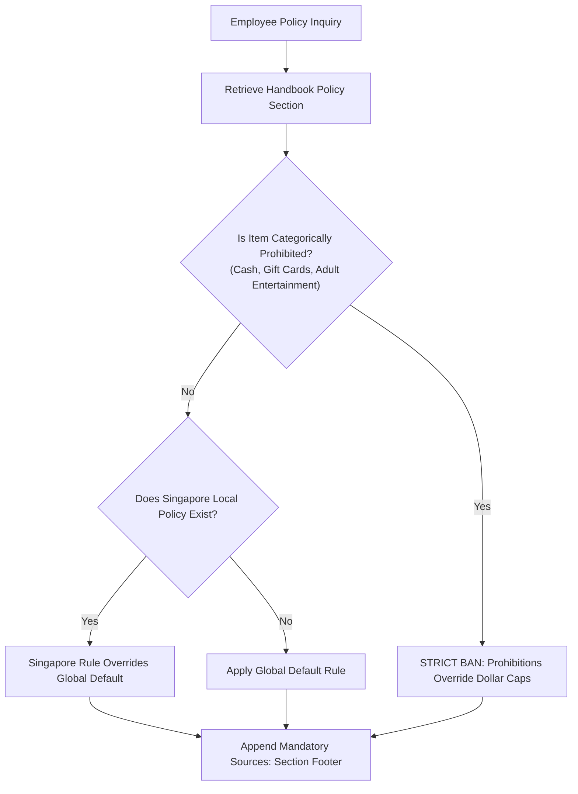

# Business Requirements Document (BRD): Project Elevate — Altostrat Singapore HR Policy Assistant

**Document Status:** Approved  
**Author:** Altostrat Singapore HR & AI Enablement Team  
**Date:** 2026-08-04  
**Version:** 1.0.0  
**Project Sponsor:** VP of People Operations, Altostrat Singapore  

---

## 1. Executive Summary & Problem Statement

### 1.1 Business Context
Altostrat Singapore employs a diverse workforce comprising full-time employees, interns, and extended workforce contractors. All corporate policies, leave allowances, expense rules, and conduct guidelines are documented in a single 52-page PDF document: the *Altostrat Singapore Employee Policy Handbook & Conduct Guidelines* (`data/handbook.pdf`).

### 1.2 Problem Statement
- **HR Bottlenecks:** Employee inquiries regarding standard policies (e.g., outpatient sick leave, Singapore childcare leave, bereavement allowances, travel expense caps, and commercial gift rules) repeatedly flood HR ticketing channels.
- **Inconsistent Guidance:** HR generalists and employees frequently misinterpret nuanced rules across the 52-page document, leading to conflicting guidance.
- **Compliance & Legal Risk (Gotcha Rules):** Certain policies contain critical exclusions or categorical prohibitions (e.g., a $45 gift card is strictly prohibited even though it is below the general $50 host-gift limit). Confident-but-wrong answers expose Altostrat to regulatory and compliance risks.

---

## 2. Business Objectives & Success Metrics

### 2.1 Core Objectives
1. **Deflect HR Inquiry Volume:** Provide instant, self-service 24/7 policy answers to employees via an AI-powered conversational assistant.
2. **Eliminate Hallucinations & Guesses:** Ensure every answer is 100% grounded in the Altostrat Handbook without extrapolation from pre-trained LLM knowledge.
3. **Auditability via Citations:** Require explicit citation of the handbook section title and section number for every factual claim.
4. **Automate Compliance Validation:** Enforce automated quality evaluation against a 100-point rubric across 20 canonical compliance cases.

### 2.2 Success Metrics (Key Performance Indicators)
| Metric | Target | Measurement Method |
|---|---|---|
| **Grounding Accuracy** | 100% | No unsupported factual claims or external hallucinations |
| **Citation Precision** | ≥ 95% | Correct handbook section number and title appended to answers |
| **Gotcha / Prohibition Detection** | 100% | Zero violations on categorical prohibitions overriding dollar caps |
| **Abstention Reliability** | 100% | Clean refusal on out-of-domain queries or unwritten policies |
| **Automated Eval Rubric Score** | ≥ 90 / 100 | Full suite test run via `evals/run_eval.py` |

---

## 3. In-Scope vs. Out-of-Scope

### 3.1 In-Scope
- Conversational question-answering on all 35 numbered policy sections in the Altostrat Singapore Handbook.
- Support for interchangeable retrieval backends (**OKF** structured graph navigation and **Vertex AI Search RAG**).
- Mathematical calculations for shift-hour leave conversions, vacation accruals, and expense caps.
- Explicit abstention when policies do not exist in the handbook.

### 3.2 Out-of-Scope (Non-Goals)
- Transactional HR actions (e.g., booking time off in Workday or submitting expense reports).
- Providing legal advice, tax advice, or technical programming support.
- Using external web search or general internet knowledge to answer policy questions.

---

## 4. Business Rules & Compliance Guardrails

### 4.1 Priority Compliance Rules
1. **Categorical Prohibitions Override Spending Thresholds:** Prohibited items (cash, gift cards, adult entertainment) are banned regardless of whether their dollar amount falls under general gift or expense caps.
2. **Singapore Jurisdiction Hierarchy:** Singapore-specific policies (e.g., Singapore Shared Parental Leave, Outpatient Sick Time, TOIL) supersede general global policy defaults.
3. **Escalation & Seniority Rules:** Approvals must respect seniority hierarchy (e.g., the most senior attendee pays for group meals; aged expenses require VP/Director approval).
4. **Strict Abstention Mandate:** If an inquiry asks about a policy not present in the handbook, the assistant must explicitly state that no policy is on file.

---

## 5. User Personas

| Persona | Role & Needs | Key Interaction Scenario |
|---|---|---|
| **Altostrat Employee** | Wants quick, accurate answers on leave, expenses, or conduct rules. | Asking if taxi fares to the airport can be expensed. |
| **People Ops / HR Specialist** | Wants to reduce ticket volume and verify answers are compliant. | Auditing assistant responses using `Sources:` citations. |
| **AI Platform Engineer** | Manages `LlmAgent`, `RETRIEVAL_MODE` switch, and CI/CD evals. | Running regression eval suites (`run_eval.py`). |

---

## 6. Acceptance Criteria (Evaluation Rubric Dimensions)

Every assistant response must satisfy the 5-dimension scoring rubric (`evals/RUBRICS.md`):
1. **Correctness (Weight 3):** All required factual claims and sub-questions are answered accurately.
2. **Grounding (Weight 3):** Zero unsupported facts; strictly derived from retrieved handbook chunks.
3. **Reasoning / Gotcha (Weight 3):** Identifies traps and demonstrates step-by-step arithmetic.
4. **Abstention (Weight 2):** Correctly refuses out-of-domain and non-existent policy queries.
5. **Citation (Weight 1):** Concludes with a valid `Sources:` section referencing exact section numbers.
