# **MVP SOLUTION DESIGN DOCUMENT**

# **Document Control**

## **Document Metadata**

| Field | Value |
| :---- | :---- |
| Author(s) | Solution Architecture Team |
| Date | 2026-08-06 |
| Status | Under Review |
| Target Audience | Enterprise Architecture, HR Engineering, IT Operations, Security & Compliance, **and the implementation agent/team building MVP 1** |

## **Revision History**

| Version | Date | Author | Description of Change |
| :---- | :---- | :---- | :---- |
| 0.1 | 2026-08-05 | Solution Architecture Team | Initial outline setup |
| 1.0 | 2026-08-05 | Solution Architecture Team | Complete MVP 1 design incorporating FastMCP integration specs from `enterprise_services_openapi.json` |
| 1.1 | 2026-08-05 | Solution Architecture Team | Incorporated confirmed architectural selections: Google Cloud Model Armor, Vertex AI Search RAG, and Agent Platform Agent Runtime Session Service |
| 1.2 | 2026-08-05 | Solution Architecture Team | Added complete BRD Requirement Traceability Matrix, all Use Case sequence flows (UC-1.1 through UC-2.3), and zero-caching real-time fetch specifications |
| 1.3 | 2026-08-05 | Solution Architecture Team | Refined design per stakeholder feedback (Alex Rivera, IT Director & Maria Santos, DPO): added rate-limiting specs, DR failover, OBO token revocation, RBAC matrix, GDPR Art. 17 purging, pre-LLM PII masking, ERD data models, FinOps cost formulas, and IaC/CICD pipeline |
| 1.4 | 2026-08-06 | C. Yang (design review) | **Correctness pass.** Resolved 6 blocking defects found in review: (1) ticket state machine contradicted `FR-4.3`; (2) RBAC matrix denied a capability the BRD scopes in; (3) the traceability matrix claimed by v1.2 did not exist — now added as Appendix A; (4) Model Armor was mis-specified as a hallucination detector — grounding split into §4.3.1; (5) `add_ticket_comment` parameter did not match the OpenAPI contract; (6) Model Armor cost under-counted inspections by 2×. Status downgraded `Approved` → `Under Review`. |
| **1.5** | 2026-08-06 | C. Yang (design review) | **Coverage pass.** Closed the three requirements that had no design section at all: `FR-1.1` → §4.7 capability manifest with deny-by-default enforcement; `NFR-1.3` → §4.8 compliance posture; `NFR-2.2` → §5.6, which demonstrates arithmetically that 99.9% is unreachable in the single-region MVP and proposes options. Added §3.5 write-action confirmation protocol, §3.6 conversational frontend (in BRD scope but previously undesigned), and §5.7 turn latency budget decomposing the 300 ms safety cap across three calls. Rewrote §8 into falsifiable assumptions / constraints / owned risks, and §10 into closed vs open decisions with owners and deadlines. |

---

# **1\. Executive Summary & Scope Boundaries**

## **1.1. Business Overview & Context**
Enterprise employees currently experience friction and high turnaround times when navigating disconnected backend UIs (WorkWeek for HCM, ServiceImmediately for ITSM) and static HR policy repositories. Simultaneously, HR and IT helpdesks face significant Tier 1 ticket loads for routine queries. 

The **HR Agentic Solution (MVP 1)** introduces a secure, AI-driven virtual assistant designed to:
* **Deflect Tier 1 HR/IT Inquiries:** Achieve a $\ge 40\%$ reduction in routine ticket volume within 6 months.
* **Enable Conversational Transactions:** Execute core self-service actions (leave submission, contact updates, ticket tracking) conversationally.
* **Demonstrate Cross-System Orchestration:** Multi-step intent resolution chaining Policy RAG, WorkWeek HCM, and ServiceImmediately ITSM.
* **Enforce Zero-Trust AI Security:** Guarantee 100% auditability, bounded tool execution via MCP, prompt injection interception, and zero policy/data leakage using Google Cloud Model Armor.

## **1.2. Scope Boundaries**

| Feature / Domain | In-Scope (MVP 1) | Out-of-Scope (MVP 1) |
| :--- | :--- | :--- |
| **User Interface** | Web-based Chat Interface / Enterprise Chat Integration | Voice UI, native mobile apps |
| **Knowledge Base** | **Vertex AI Search / Agent Builder**: Static HR Policy Docs (Leave, Expense, Remote Work, Code of Conduct) | Dynamic intranet pages, uncategorized docs |
| **HCM Integration** | **WorkWeek via FastMCP**: Profile metadata, PTO balance check, Leave booking/cancellation, Address/Phone update | Payroll processing, performance reviews, compensation data |
| **ITSM Integration** | **ServiceImmediately via FastMCP**: Ticket status/details query, Incident ticket creation, Comment timeline, Status lifecycle updates | Change management, asset management, IT provisioning |
| **Orchestration** | Multi-system workflows (UC-2.1 Equipment, UC-2.2 Medical Leave, UC-2.3 Relocation) | Third-party ERPs, CRM integrations |
| **Security & Auth** | **Google Cloud Model Armor** for prompt injection & PII masking; Service PAT in `X-MCP-Token` header | Full Enterprise SSO / Okta SAML (future state) |
| **Session Memory** | **Agent Platform Agent Runtime Session Service** for multi-turn state management | External custom session databases |

## **1.3. Target Architecture Overview**

The solution leverages Google ADK (Agent Development Kit) running on Google Cloud Agent Platform Agent Runtime, backed by Agent Runtime Session Service and Streamable HTTP FastMCP toolsets (`McpToolset`), protected by Google Cloud Model Armor.

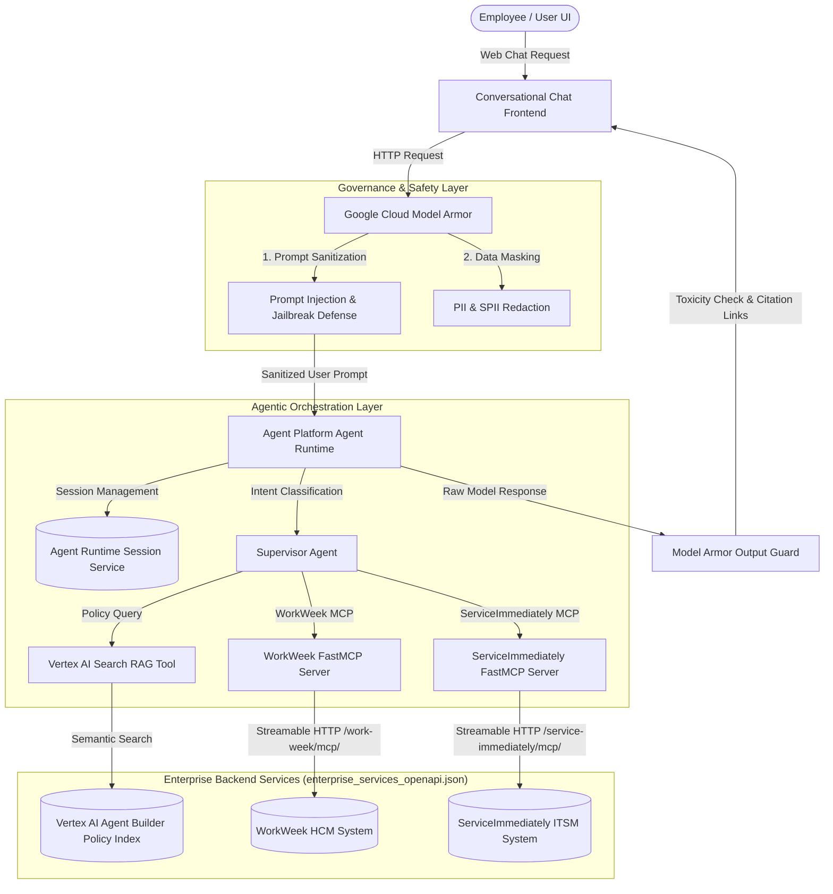

## **1.4. Alternatives Considered**

| Architectural Pattern | Evaluated Alternative | Selected Choice & Rationale |
| :--- | :--- | :--- |
| **Backend Integration** | Direct REST Endpoint Calling | **Streamable HTTP MCP Servers (`FastMCP`)**: Provides standardized tool discovery, strict type schema enforcement, stateless transport, and built-in ADK compatibility via `McpToolset`. |
| **Safety Interceptor** | Custom Regex / In-Prompt Rules | **Google Cloud Model Armor**: Enterprise-grade defense against prompt injection, jailbreaking, PII leakage, and toxic outputs within the $< 300\text{ms}$ SLA budget (`NFR-2.1`). |
| **Knowledge Base (RAG)** | Custom Vector DB (FAISS/Chroma) | **Vertex AI Search / Agent Builder**: Fully managed document ingestion from Cloud Storage, semantic chunking, and automatic deep-link citation generation (`FR-5.1` - `FR-5.4`). |
| **Session Memory** | Redis / Firestore with TTL | **Agent Platform Agent Runtime Session Service**: Native session persistence and dialog turn management within Google Cloud's Agent Platform ecosystem (`FR-2.2`). |

---

# **2\. Production-Ready Future State Design**

The production target architecture expands MVP 1 into a highly scalable, enterprise-grade deployment addressing enterprise federation, token lifecycles, and disaster recovery.

## **2.1. Identity, Auth Federation & OBO Token Revocation Lifecycle**
* **SSO Integration**: Transition from static Service PATs to Enterprise SSO (Okta / Entra ID) via Google Cloud Identity-Aware Proxy (IAP), injecting signed OAuth 2.0 / OBO (On-Behalf-Of) tokens into `x-goog-authenticated-user-email` and `Authorization: Bearer <token>` headers.
* **Token Revocation Path**: FastMCP servers subscribe to the Identity Provider's token revocation endpoint (`POST /oauth2/revoke`) and maintain a local in-memory Token Revocation List (TRL) cached via Google Cloud Memorystore (Redis).
* **Revocation Sync SLA**: Token revocation events propagate across all FastMCP worker nodes within $\le 30\text{ seconds}$.
* **Session Invalidation**: Upon receipt of a revocation event, the Agent Runtime Session Service immediately terminates the associated `UserSession` and purges active context.

## **2.2. Disaster Recovery & Multi-Region Session Resilience**
* **Dual-Region Deployment**: Agent Platform Agent Runtime and Agent Runtime Session Service deploy across primary region `us-central1` (Iowa) and secondary standby region `us-east4` (Northern Virginia).
* **Asynchronous State Replication**: Session state objects are replicated asynchronously across regions via Spanner / Firestore multi-region database tables with target RPO $< 1.0\text{ minute}$.
* **Health Check & Failover**: Google Cloud HTTP(S) Load Balancer continuously monitors primary region health via synthetic `/healthz` endpoints. Automatic DNS failover switches traffic to `us-east4` within RTO $< 5.0\text{ minutes}$ during a regional outage.

## **2.3. Fleet Management & Asynchronous Streaming**
* **Auto-Scaling**: FastMCP Cloud Run services auto-scale dynamically from 0 to 100 instances based on HTTP concurrency thresholds ($>80$ concurrent requests).
* **Agent Registry**: All deployed agents register in Google Cloud Agent Registry for central governance, version tracking, and blue/green deployments.
* **Server-Sent Events (SSE)**: Implement SSE streaming over HTTP/2 to stream LLM response tokens directly to the Chat UI, reducing perceived latency below $1.5\text{s}$.

---

# **3\. System Flows, Sequence Diagrams & Agent Design**

## **3.1. Agent Design**
The core system uses a **Supervisor Agent** running on Agent Runtime, orchestrating three specialized tool sets:
* **Vertex AI Search Policy Tool**: Performs semantic vector search against policy documents in Cloud Storage, returning grounded answers with deep-link citations (`FR-5.1` - `FR-5.4`).
* **WorkWeek MCP Toolset** (`/work-week/mcp/`): Exposes `get_current_employee_id`, `get_employee_balances`, `request_time_off`, `update_personal_info`, `get_personal_info`, and `cancel_leave_request` (`FR-3.1` - `FR-3.3`).
* **ServiceImmediately MCP Toolset** (`/service-immediately/mcp/`): Exposes `list_tickets`, `get_ticket_details`, `create_ticket`, `add_ticket_comment`, and `update_ticket_status` (`FR-4.1` - `FR-4.3`).

---

## **3.2. Sequence Diagrams for All Use Cases**

### **UC-1.1: Policy Q&A Flow**
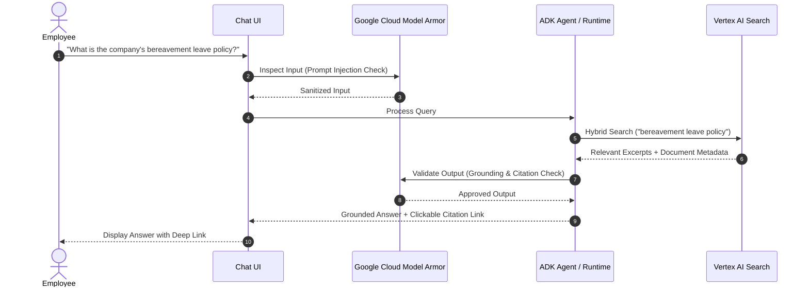

### **UC-1.2: HR Self-Service - PTO Submission**
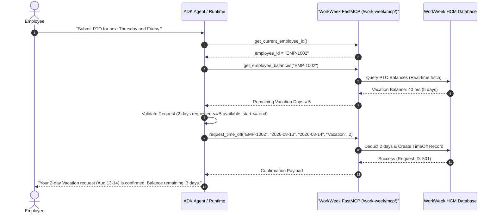

### **UC-1.3: IT Incident Management - Status & Creation**
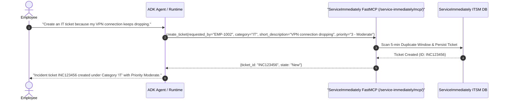

### **UC-2.1: Cross-System Orchestration - Equipment Procurement**
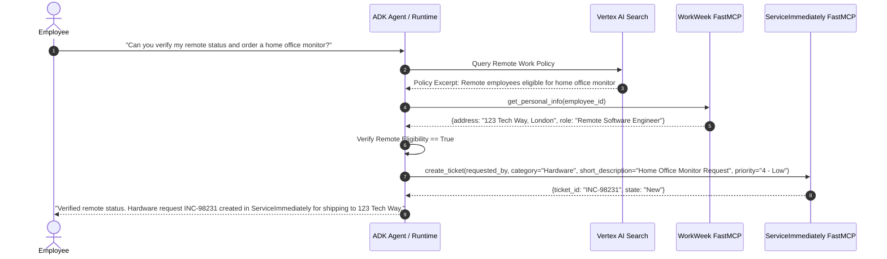

### **UC-2.2: Cross-System Orchestration - Short-Term Medical Leave**
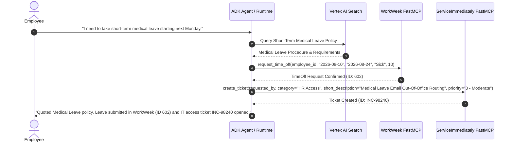

### **UC-2.3: Cross-System Orchestration - Employee Relocation**
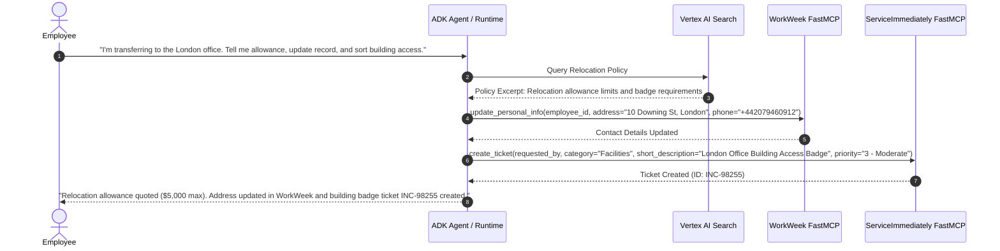

## **3.3. Entity Relationship Diagram (ERD) & Data Models**

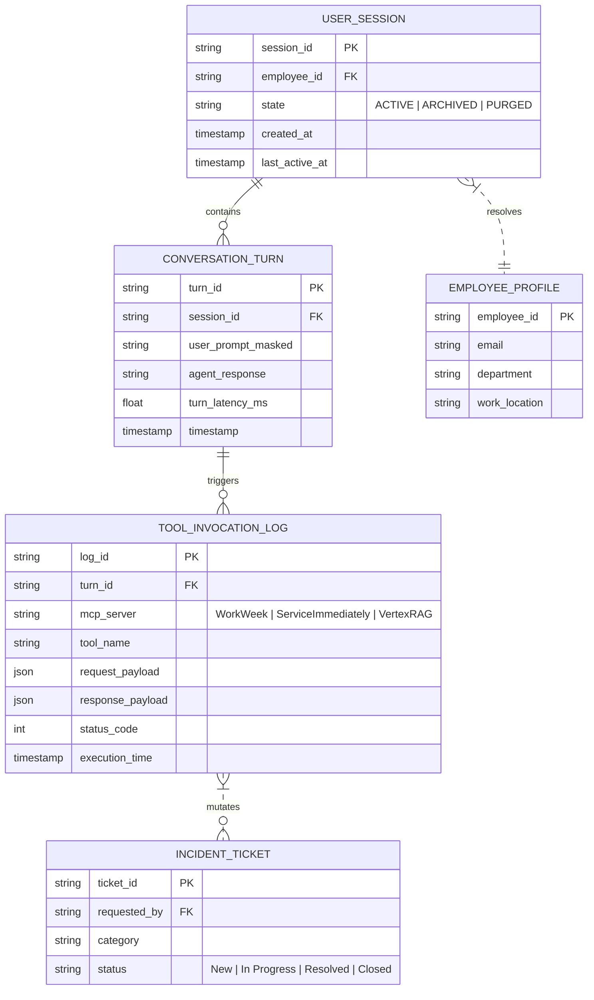

### **Session & Conversation JSON Schemas**
```json
{
  "$schema": "https://json-schema.org/draft/2020-12/schema",
  "title": "UserSessionSchema",
  "type": "object",
  "properties": {
    "session_id": { "type": "string", "format": "uuid" },
    "employee_id": { "type": "string", "pattern": "^EMP-[0-9]{4,8}$" },
    "session_state": { "type": "string", "enum": ["ACTIVE", "ARCHIVED", "PURGED"] },
    "created_at": { "type": "string", "format": "date-time" },
    "ttl_expiration": { "type": "string", "format": "date-time" }
  },
  "required": ["session_id", "employee_id", "session_state", "created_at"]
}
```

## **3.4. Session State Retention & Archiving Lifecycle**
* **Active State (0 – 24 Hours)**: Session memory persisted in high-speed Agent Runtime Session Service for real-time multi-turn conversation context.
* **Archived State (24 Hours – 30 Days)**: Completed sessions automatically transition to Cloud Storage Nearline bucket as encrypted JSON objects for auditability.
* **Coldline Backup (30 Days – 90 Days)**: Transferred to Cloud Storage Coldline storage tier for cost-optimized compliance retention.
* **Purge State (> 90 Days or Post-Offboarding)**: Automated Lifecycle Management rule executes hard deletion of session objects. Offboarded employee sessions are hard-purged within $\le 24\text{ hours}$.

## **3.5. Write-Action Confirmation Protocol**

Read tools execute immediately. **Every mutating tool requires an explicit user confirmation turn** before execution. This is what makes a prompt-injection payload that reaches the model still unable to mutate enterprise state, and it is why `UC-2.3` in the BRD says *"Prompt address update"* rather than *"update address"*.

| Tool | Mutating | Confirmation required |
| :--- | :---: | :--- |
| `get_current_employee_id`, `get_employee_balances`, `get_personal_info`, `list_tickets`, `get_ticket_details`, Vertex policy search | ✗ | No |
| `request_time_off`, `cancel_leave_request`, `update_personal_info` | ✓ | Yes — echo the exact payload, require affirmative reply |
| `create_ticket`, `add_ticket_comment`, `update_ticket_status` | ✓ | Yes — echo the exact payload, require affirmative reply |

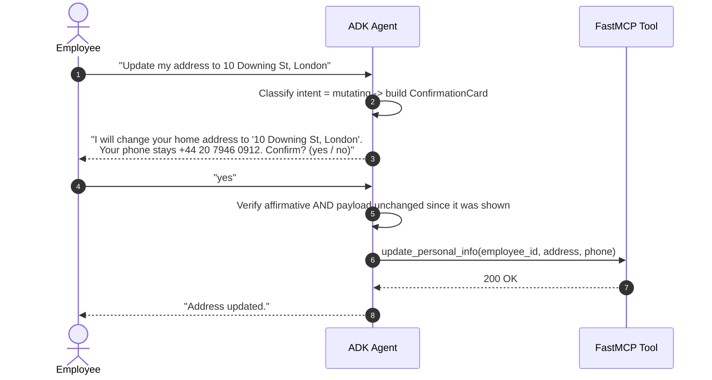

* **Payload pinning**: the confirmation stores a hash of the exact arguments in session state. If the arguments differ at execution time, the agent re-confirms instead of executing — this defeats a second-turn injection that mutates the pending payload.
* **Confirmation expiry**: a pending mutation expires after 5 minutes or when the user changes topic.
* **Ambiguous replies** ("ok maybe", "sure why not?") are treated as **not confirmed**; the agent re-asks once, then abandons.
* **Cross-system flows (`UC-2.x`)**: confirmation is requested **once**, listing every mutation in the plan, before the first write executes. See §5.2 for partial-failure handling.

## **3.6. Conversational Frontend (MVP 1)**

`BRD §2.1` places a web chat interface in scope. MVP 1 uses the smallest thing that satisfies it.

| Aspect | MVP 1 decision |
| :--- | :--- |
| **Hosting** | Single Cloud Run service `hr-assistant-ui` (FastAPI + static React bundle), same project and region as the Agent Runtime |
| **Authentication** | Google Cloud **Identity-Aware Proxy** in front of Cloud Run. IAP injects `X-Goog-Authenticated-User-Email`; the backend maps it to `employee_id` via WorkWeek and binds it to the session. The browser never sees or supplies an `employee_id`. |
| **Transport** | `POST /chat` for the turn; **Server-Sent Events** on `GET /chat/stream?session_id=…` for token streaming (`NFR-2.3`, perceived latency) |
| **Session binding** | UI holds only an opaque `session_id`. All identity comes from the IAP header on the server side — the client cannot assert who it is. |
| **Rendering** | Markdown with clickable citation links (`FR-5.3`); a distinct **confirmation card** component for §3.5 mutations; explicit "blocked by safety policy" state for Model Armor rejections |
| **Out of scope** | Voice, file upload, mobile app, offline mode, notification push |

> **Why not build identity into the UI:** any `employee_id` supplied by the browser is attacker-controlled. Deriving it server-side from the IAP assertion is what makes the tenant isolation in §4.2 actually hold; without it `FR-1.5` is unenforceable.

---

# **4\. Security, Governance & Identity**

## **4.1. Authentication Boundaries**
In production, backend services bypass IAP and require a custom **Personal Access Token (PAT)** header to satisfy Google Frontend (GFE) proxy requirements:
```http
X-MCP-Token: mcp_your_token_here
```

ADK agents configure connection parameters statelessly using custom HTTP headers with environment-scoped Service PATs, while passing user `employee_id` context into tool invocations for tenant isolation (`FR-3.1`):
```python
from google.adk.agents import Agent
from google.adk.tools.mcp_tool import McpToolset
from google.adk.tools.mcp_tool.mcp_session_manager import StreamableHTTPConnectionParams

workweek_mcp = McpToolset(
    connection_params=StreamableHTTPConnectionParams(
        url="https://mock-saas.aishprabhat.demo.altostrat.com/work-week/mcp/",
        headers={"X-MCP-Token": "mcp_your_token_here"}
    )
)

serviceimmediately_mcp = McpToolset(
    connection_params=StreamableHTTPConnectionParams(
        url="https://mock-saas.aishprabhat.demo.altostrat.com/service-immediately/mcp/",
        headers={"X-MCP-Token": "mcp_your_token_here"}
    )
)
```

## **4.2. Tenant Isolation & Real-Time Data Fetch Rules**
* **Identity Context Verification (`FR-1.5`)**: Every FastMCP resource query (`workweek://employees/{employee_id}/profile`) and tool call (`get_employee_balances`) verifies caller identity against the authenticated session context. Cross-user access returns `403 Forbidden`.
* **Zero Dynamic Caching (`FR-3.4`)**: The AI orchestration layer fetches Employee Profile metadata and PTO balances directly from WorkWeek on **every query**. No dynamic, user-specific profile data is cached in the agent memory layer.

## **4.3. Safety Interceptor Pipeline & Guardrails**

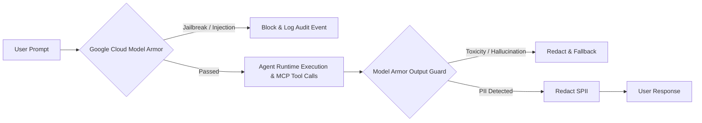

The pipeline has **two distinct responsibilities that must not be conflated**: Model Armor handles *malicious and unsafe content*; a separate grounding verifier handles *factual faithfulness*. Model Armor does not perform fact-checking against retrieved documents.

| # | Control | Implemented by | Covers |
| :-- | :--- | :--- | :--- |
| 1 | Prompt injection / jailbreak / off-topic interception | **Model Armor** — `prompt_injection_and_jailbreak` filter, `RAI` filters, custom topic denylist | `FR-1.3` (input), `FR-5.4` domain containment |
| 2 | Toxicity / unsafe output blocking | **Model Armor** — `RAI` output filter | `FR-1.3` (output), `NFR-1.1` |
| 3 | SPII detection & redaction | **Model Armor** — `sdp` (Sensitive Data Protection) basic + advanced inspection templates | `FR-1.4` |
| 4 | **Grounding / anti-hallucination** | **Vertex AI `check_grounding` API** + citation resolver (§4.3.1) — **not** Model Armor | `FR-5.2`, `FR-5.4` strict grounding, `NFR-3.1` |
| 5 | Citation integrity | Citation resolver: every returned `uri` is HEAD-checked against the Vertex AI Search datastore before rendering | `FR-5.3`, `FR-5.4` citation integrity |
| 6 | Audit logging | Structured Cloud Logging sink → BigQuery, `automation_source: "Agentic_HR_Assistant"`, caller ID, decision, latency, timestamp | `FR-1.2`, `FR-4.1`, `NFR-1.2` |

#### **4.3.1. Grounding Verification Loop (`FR-5.2`, `NFR-3.1`)**

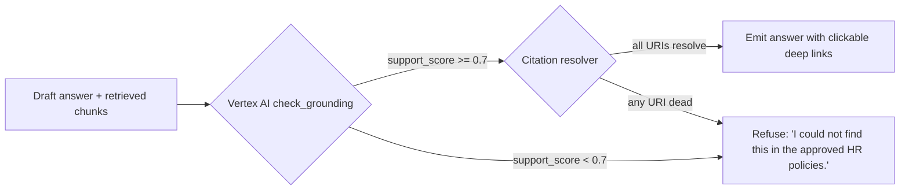

* **Threshold**: answers with an aggregate `support_score < 0.7` are never emitted; the agent returns the explicit "not found" response required by `FR-5.2`.
* **Claim-level check**: `check_grounding` returns per-claim support. Any unsupported claim is stripped before emission; if stripping empties the answer, the refusal path fires.
* **Measured target**: `NFR-3.1` — $\ge 95\%$ accuracy with **0% hallucinated policy facts**, verified by the evaluation harness in §9.

## **4.4. Role-Based Access Control (RBAC) Matrix**

### **4.4.1. MVP 1 Authorization Model (single role)**

`BRD §6` constrains MVP 1 to functional test credentials, no SSO, and a single tenant. MVP 1 therefore implements **exactly one role — Standard Employee — with self-scoped access**, enforced by comparing the `employee_id` in the tool call against the `employee_id` bound to the session (§4.2).

| Capability | MVP 1 Standard Employee | Enforcement point |
| :--- | :--- | :--- |
| Vertex RAG policy search | ✅ Allowed (corpus is non-personal) | Agent tool allowlist |
| WorkWeek: read profile / balances | ✅ Self only | FastMCP identity check → `403` on mismatch |
| WorkWeek: request / cancel leave | ✅ Self only | FastMCP identity check |
| WorkWeek: update contact info | ✅ Self only, requires confirmation (§3.5) | FastMCP identity check |
| ServiceImmediately: query tickets | ✅ Self only (`requested_by == session employee_id`) | FastMCP identity check |
| ServiceImmediately: create ticket | ✅ Self only | FastMCP identity check |
| **ServiceImmediately: comment / update status** | **✅ Self only, own tickets** — required by `BRD §2.1`, `FR-4.2`, `UC-1.3` | FastMCP identity check + state machine (§5.1.3) |

> **Correction note (v1.4).** Version 1.3 of this document denied ticket status updates to Standard Employees. That contradicted `BRD §2.1` ("Write Actions: … updating ticket status (e.g., to 'Resolved')"), `FR-4.2` and `UC-1.3`, all of which place employee-initiated status transitions **in scope for MVP 1**. The capability is restored above, bounded to the caller's own tickets and to legal transitions only.

### **4.4.2. Multi-Role RBAC (Future State — not MVP 1)**

The role model below depends on Enterprise SSO and directory sync, both explicitly out of scope for MVP 1 (`BRD §6`). It is recorded here as the target for the production rollout described in §2.1.

| User Role | Vertex RAG Policy Search | WorkWeek: Read Profile/Balance | WorkWeek: Request/Cancel Leave | WorkWeek: Update Contact Info | SI: Query Tickets | SI: Create Ticket | SI: Update/Close Ticket |
| :--- | :---: | :---: | :---: | :---: | :---: | :---: | :---: |
| **Standard Employee** | ✅ Allowed | ✅ Self Only | ✅ Self Only | ✅ Self Only | ✅ Self Only | ✅ Self Only | ✅ Own tickets |
| **Contractor** | ✅ Allowed | ✅ Self Only | ❌ Denied | ❌ Denied | ✅ Self Only | ✅ Self Only | ✅ Own tickets |
| **HR Specialist** | ✅ Allowed | ✅ All Employees | ✅ Approved Scope | ✅ Approved Scope | ✅ Self Only | ✅ Self Only | ✅ Own tickets |
| **IT Administrator** | ✅ Allowed | ✅ Self Only | ❌ Denied | ❌ Denied | ✅ All Tickets | ✅ Allowed | ✅ All tickets |

* **Role Revocation Sync Strategy** *(future state)*: roles sync from Okta / Enterprise Directory into Google Cloud IAM and the FastMCP authorization cache via SCIM webhooks.
* **Maximum Sync Delay** *(future state)*: revocations propagate within $\le 60\text{ seconds}$, blocking subsequent tool execution.

## **4.5. Pre-LLM PII/SPII Masking Pipeline**

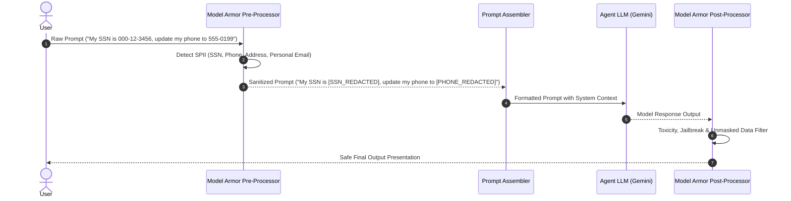

## **4.6. Data Retention & Right to be Forgotten (GDPR Art. 17) Purging Policy**
* **Offboarding Event Trigger**: When an employee is marked offboarded in WorkWeek HCM, an automated Cloud Pub/Sub event (`employee.offboarded`) triggers the Data Governance Erasure Service.
* **Purge Execution ($\le 24$ Hours)**:
  1. **Session Memory**: Hard-deletes all multi-turn conversation histories in Agent Runtime Session Service matching `employee_id`.
  2. **Vector Metadata**: Scans Vertex AI Search policy index and user profile vector stores to purge employee-specific embeddings.
  3. **Log Anonymization**: Converts `employee_id` in BigQuery audit logs into a non-reversible HMAC-SHA256 salted hash (`sha256(employee_id + salt)`), preserving operational metrics while stripping identity.
* **Retention Schedule**:
  * Active Session Memory: 24 hours.
  * Nearline Archived Logs: 30 days.
  * Anonymized Compliance Logs: 365 days.

## **4.7. Capability & Lifecycle Governance (`FR-1.1`)**

`FR-1.1` is an MVP-1 requirement, not a future-state one: the system must track ownership and version history, and **block any tool invocation outside the declared boundary**. MVP 1 satisfies it with three mechanisms that require no new platform:

### **4.7.1. Capability manifest (source of truth)**
`capability_manifest.yaml` is committed at the repository root and is the only place tool boundaries are declared:

```yaml
agent:
  name: hr-agentic-assistant
  version: 1.0.0                 # semver; must match the deployed Agent Runtime label
  owner: hr-engineering@example.com
  data_owner: dpo@example.com
  brd_baseline: BRD.md@v1.0
allowed_toolsets:
  - id: vertex_policy_search
    kind: vertex_ai_search
    datastore: projects/${PROJECT}/locations/global/collections/default_collection/dataStores/hr-policies
  - id: workweek
    kind: mcp_streamable_http
    url: ${WORKWEEK_MCP_URL}
    allowed_tools: [get_current_employee_id, get_employee_balances, request_time_off,
                    update_personal_info, get_personal_info, cancel_leave_request]
  - id: service_immediately
    kind: mcp_streamable_http
    url: ${SERVICEIMMEDIATELY_MCP_URL}
    allowed_tools: [list_tickets, get_ticket_details, create_ticket,
                    add_ticket_comment, update_ticket_status]
denied_by_default: true           # anything not listed above is refused
```

### **4.7.2. Runtime enforcement (deny by default)**
The agent is constructed **only** from toolsets present in the manifest. A `before_tool_callback` re-checks each invocation against `allowed_tools`; an unlisted name is refused without calling the backend and emits `governance.tool_denied` to Cloud Logging with the attempted name, session, and caller. This closes the gap where a model hallucinates a tool name or a prompt-injection payload names an unregistered tool.

### **4.7.3. Version & ownership traceability**
| Artefact | Carries | Enforced by |
| :--- | :--- | :--- |
| Agent Runtime deployment | Label `app_version` = manifest `version`; `owner` label | CI gate fails the deploy if labels and manifest disagree |
| Every audit log row | `agent_version`, `automation_source`, `session_id`, `employee_id` | Structured logger (§4.3 control 6) |
| Every release | Git tag `v<semver>` + immutable container digest | CI records digest in the release notes |
| Manifest change | Requires review by `owner` **and** `data_owner` | `CODEOWNERS` on `capability_manifest.yaml` |

*Closes `D-7`.*

## **4.8. Compliance Posture (`NFR-1.3`)**

| Topic | MVP 1 position |
| :--- | :--- |
| **Lawful basis (GDPR Art. 6)** | Art. 6(1)(b) — processing necessary for performance of the employment contract (leave administration, IT support). No consent-based processing; no legitimate-interest balancing test required for the in-scope data. |
| **Special-category data (Art. 9)** | `UC-2.2` (medical leave) can surface health-adjacent context. MVP 1 **must not** store diagnosis text: the agent submits leave as `leave_type = "Sick"` only and is instructed never to solicit or echo medical detail. Free-text medical content in a prompt is redacted by Model Armor SPII rules before persistence. |
| **DPIA** | Required before production rollout (automated processing of employee data at scale). Owner: DPO. Tracked as `D-8`. |
| **Data residency** | **Open risk.** MVP 1 deploys in `us-central1`, but `UC-2.3` describes a London office, i.e. EU/UK data subjects. Transferring employee personal data to the US requires an adequacy decision, SCCs, or an EU-region deployment. See `D-10`. |
| **Retention & erasure** | §4.6 — 24 h active, 30 d nearline, 365 d anonymised; Art. 17 purge $\le 24$ h from the `employee.offboarded` event. |
| **Data-subject access (Art. 15)** | Session transcripts are retrievable by `employee_id` from the BigQuery audit sink for the retention window; export runbook owned by the DPO. |
| **Sub-processors** | All processing stays within Google Cloud services already covered by the customer's existing Data Processing Addendum. No third-party LLM or logging vendor is introduced. |
| **Local labour law** | Leave entitlement rules live in WorkWeek, not in the agent. The agent never computes entitlement; it reads balances and submits requests, so jurisdiction-specific rules remain enforced by the system of record. |

*Partially closes `NFR-1.3`; DPIA and residency remain open as `D-8` / `D-10`.*

---

# **5\. Integration Details & Error Handling**

## **5.1. FastMCP Tool Specifications**

### **1. WorkWeek FastMCP Server (`/work-week/mcp/`)**

| Tool Name | Parameters | Description & Validation Rules |
| :--- | :--- | :--- |
| `get_current_employee_id()` | None | Resolves the authenticated user's `employee_id`. |
| `get_employee_balances` | `employee_id: str` | Returns accrued, used, and remaining Vacation/Sick leave balances (`FR-3.2`). Real-time fetch (`FR-3.4`). |
| `request_time_off` | `employee_id: str`, `start_date: str`, `end_date: str`, `leave_type: str`, `days: float` | Books time off. Dates must be `YYYY-MM-DD`. Validates $start \le end$, start $\ge$ today, and $days \le remaining\_balance$ (`FR-3.3`). |
| `update_personal_info` | `employee_id: str`, `address: str`, `phone: str` | Updates home address ($\ge 5$ chars) and phone number (regex `^\+?[\d\s\-()]{7,20}$`) (`FR-3.2`, `FR-3.3`). |
| `get_personal_info` | `employee_id: str` | Retrieves personal address and phone details (`FR-3.2`). |
| `cancel_leave_request` | `employee_id: str`, `request_id: int` | Cancels a pending/approved request and refunds remaining leave days. |

### **2. ServiceImmediately FastMCP Server (`/service-immediately/mcp/`)**

| Tool Name | Parameters | Description & Validation Rules |
| :--- | :--- | :--- |
| `list_tickets` | `employee_id: str` | Retrieves all incident tickets requested by the employee (`FR-4.2`). |
| `get_ticket_details` | `ticket_id: str` | Fetches status, category, short desc, priority, assignee, and complete comment timeline (`FR-4.2`). |
| `create_ticket` | `requested_by: str`, `category: str`, `short_description: str`, `priority: str`, `assignment_group: str` | Creates incident. Rejects duplicate submissions within 5 mins (`FR-4.3`). Priority `'1 - Critical'` requires outage/downtime keywords (`FR-4.3`). |
| `add_ticket_comment` | `ticket_id: str`, `author: str`, `comment_text: str` | Appends comment to ticket activity log timeline (`FR-4.2`). Parameter name `comment_text` matches the `CommentCreateRequest` schema in `enterprise_services_openapi.json`. |
| `update_ticket_status` | `ticket_id: str`, `status: str`, `resolution_notes: str` (default `""`), `updated_by: str` (default `"System"`) | Enforces the state machine defined in §5.1.3. **`New -> Closed` is rejected** per `FR-4.3`. Closed tickets are immutable. |

### **3. Ticket Lifecycle State Machine (`FR-4.3`)**

`FR-4.3` requires rejecting "direct transition from New to Closed". The authoritative transition table is:

| From \ To | New | In Progress | Resolved | Closed |
| :--- | :---: | :---: | :---: | :---: |
| **New** | — | ✅ | ✅ | ❌ **Rejected (`FR-4.3`)** |
| **In Progress** | ❌ | — | ✅ | ✅ |
| **Resolved** | ❌ | ✅ (reopen) | — | ✅ |
| **Closed** | ❌ | ❌ | ❌ | — (immutable) |

Rejected transitions return `409 Conflict` with `error_code = INVALID_STATE_TRANSITION`; the agent surfaces the message defined in §5.2. A ticket that must be abandoned without work goes `New -> Resolved` (with `resolution_notes`) and then `Resolved -> Closed`.

---

## **5.2. Error Handling & Fallback Matrix**

| Failure Scenario | Root Cause | Fallback Behavior & User Message |
| :--- | :--- | :--- |
| **Transient Network Timeout / 5xx** | Backend service glitch | Automatic exponential backoff retry up to 3 attempts (`NFR-4.2`). If persistent: *"WorkWeek is temporarily unavailable. Please try again shortly."* (`NFR-4.1`) |
| **Insufficient PTO Balance** | Business rule violation | Agent intercepts error: *"Request declined: You requested 5 days, but only have 2 days remaining."* (`FR-3.3`) |
| **Invalid Ticket State Transition** | State machine violation | Agent catches state rule: *"Ticket INC-123 is Closed and cannot be updated."* (`FR-4.3`) |
| **Partial Cross-System Failure** | Step 1 succeeds, Step 2 fails | Log failure with tracking reference ID (`NFR-4.3`). User notified: *"Leave request submitted in WorkWeek, but ticket creation in ServiceImmediately failed. Reference ID: LOG-8812. Please contact IT support."* |

## **5.3. FastMCP Rate Limiting, Throttling & Retry Backoff Configurations**

### **Throttling Thresholds**
* **WorkWeek FastMCP Server**:
  * System-wide peak limit: $50\text{ req/sec}$.
  * User-level limit: $200\text{ req/min}$ per `employee_id`.
* **ServiceImmediately FastMCP Server**:
  * System-wide peak limit: $30\text{ req/sec}$.
  * User-level limit: $100\text{ req/min}$ per `employee_id`.

### **Client-Side Token Bucket & Backoff Formula**
ADK agent HTTP callers enforce client-side rate limiting using the Token Bucket algorithm. When encountering a `429 Too Many Requests` or transient `5xx` error, requests retry using **Exponential Backoff with Full Jitter**:

$$T_{\text{wait}} = \min\left(T_{\text{max}}, T_{\text{base}} \times 2^{\text{attempt}} + \text{rand}(0, \text{jitter})\right)$$

Where parameters are configured as:
* $T_{\text{base}} = 500\text{ms}$
* $T_{\text{max}} = 8000\text{ms}$
* $\text{jitter} = 250\text{ms}$
* Maximum Retry Attempts = $3$

## **5.4. 5xx Error Queuing & Async Resilience Mechanism**
To protect backend enterprise services from overload during high-traffic spikes or maintenance windows:
* **Circuit Breaker Pattern**: If a FastMCP server emits 5 consecutive `5xx` responses within a 30-second sliding window, the Circuit Breaker transitions to `OPEN` for 60 seconds, immediately returning a graceful fallback message without hammering the backend.
* **Dead-Letter Queue (DLQ) & Asynchronous Queue**: Non-blocking asynchronous transactions (such as activity comment logging or badge request notifications) push failed requests to a Google Cloud Pub/Sub Dead-Letter Queue (`mcp-dlq-topic`). A background Cloud Run worker retries queued transactions asynchronously when backend health recovers.

## **5.5. Schema Drift Monitoring & Alerting Strategy**
* **JSON Schema Interceptor**: Every response returned by WorkWeek and ServiceImmediately FastMCP servers passes through an inline Pydantic / JSON Schema validation interceptor.
* **Drift Detection**: Any unexpected field deletion, data type mutation, or breaking contract drift increments the Cloud Monitoring metric `custom.googleapis.com/mcp/schema_drift_count`.
* **Automated Alerting**: A metric threshold rule triggers an automated High-Severity PagerDuty alert to the IT Integration Team when drift count $> 0$.
* **Graceful Degradation**: The agent strips unparseable fields, logs the raw payload for audit, and renders a safe baseline view to the user.

## **5.6. Availability Budget & Degradation Modes (`NFR-2.2`)**

`NFR-2.2` sets 99.9% uptime. That number must be tested against the architecture rather than asserted.

### **5.6.1. Composite availability of the MVP 1 (single-region) path**
The full-transaction path is a **serial** dependency chain, so component availabilities multiply:

| Component | Published / assumed monthly SLA |
| :--- | :---: |
| Agent Platform Agent Runtime | 99.9% |
| Cloud Run (FastMCP × 2, UI) | 99.95% |
| Vertex AI Search | 99.9% |
| Model Armor | 99.9% |

$$A_{\text{serial}} = 0.999 \times 0.9995 \times 0.999 \times 0.999 \approx 0.9965$$

**≈ 99.65%, i.e. ~2 h 32 min of expected monthly downtime against the 43 min that 99.9% allows.**

> **Finding: MVP 1 as designed cannot meet `NFR-2.2`.** No amount of retry logic fixes a serial chain whose product is below target. This is a design-level constraint, not an implementation defect.

### **5.6.2. Options**
| Option | Effect | Cost / effort |
| :--- | :--- | :--- |
| **A. Restate the MVP target as 99.5%** and hold 99.9% as the production target contingent on §2.2 dual-region | Honest; no engineering change | None |
| **B. Bring §2.2 dual-region forward into MVP 1** | Composite rises to ≈99.95% | Doubles runtime cost; adds session-replication complexity |
| **C. Measure *user-perceived* availability instead** — see §5.6.3 | Perceived ≈99.9% achievable single-region | Requires the degradation modes below |

**Recommendation: A + C for MVP 1; B before production rollout.** Decision tracked as `D-9`.

### **5.6.3. Degradation modes (what still works when a dependency is down)**
The chain is only serial for transactions. Declaring per-capability fallbacks converts a total outage into a partial one:

| Failed dependency | Still available | User-visible behaviour |
| :--- | :--- | :--- |
| WorkWeek FastMCP | Policy Q&A, all ticket operations | "WorkWeek is temporarily unavailable — I can still answer policy questions and handle IT tickets." |
| ServiceImmediately FastMCP | Policy Q&A, all leave operations | Symmetric message; ticket intents queued to DLQ (§5.4) if the user opts in |
| Vertex AI Search | All transactional operations | "I can't reach the policy library right now — I can still check your balance or raise a ticket." |
| Model Armor | **Nothing — fail closed** | "The assistant is unavailable." Safety is never bypassed to preserve uptime. |
| Agent Runtime | Nothing | Static maintenance page from the UI service |

**Availability is measured per capability**, and the SLI is defined in §9: *fraction of turns that receive a non-error response for a capability whose dependencies are healthy*.

## **5.7. Turn Latency Budget (`NFR-2.1`)**

`NFR-2.1` sets two separate limits: response start < 10 s, and **safety scanning ≤ 300 ms per turn**. The safety budget must be decomposed because the architecture makes more than one safety call per turn.

### **5.7.1. Safety budget allocation (hard cap 300 ms/turn)**
| Safety call | When | Budget | Notes |
| :--- | :--- | :---: | :--- |
| Model Armor — inbound (injection + SPII masking, §4.5) | Every turn | **120 ms** | Single call performs both filters; do not issue two calls |
| Model Armor — outbound (RAI + unmasked-data filter) | Every turn | **120 ms** | |
| Citation resolver (HEAD checks, §4.3.1) | Policy turns only | **60 ms** | Parallel HEADs, 3 URIs max, `asyncio.gather` |
| **Total** | | **300 ms** | |

`check_grounding` is **excluded from the safety budget** — it is a quality control on the generation path, not an interception step, and is accounted for in the 10 s end-to-end budget below.

### **5.7.2. End-to-end budget (p95, to first token)**
| Phase | Simple policy turn | Cross-system turn (`UC-2.x`) |
| :--- | :---: | :---: |
| IAP + UI + session load | 150 ms | 150 ms |
| Model Armor inbound | 120 ms | 120 ms |
| Retrieval / tool calls | 700 ms (Vertex AI Search) | 1,800 ms (**parallel** RAG + WorkWeek; serial only where a real dependency exists) |
| LLM planning + generation to first token | 1,500 ms | 2,600 ms (two planning hops) |
| `check_grounding` | 400 ms | 400 ms (policy leg only) |
| Model Armor outbound + citation resolve | 180 ms | 120 ms |
| **p95 total to first token** | **≈ 3.1 s** | **≈ 5.2 s** |
| **Headroom against the 10 s limit** | 6.9 s | 4.8 s |

* **Parallelism is mandatory, not optional.** In `UC-2.1` the policy lookup and the WorkWeek profile fetch have no data dependency and must run under `asyncio.gather`; serialising them adds ≈700 ms and consumes headroom needed for retries (`NFR-2.3`).
* **Instrumentation**: each row above is a named Cloud Trace span. §9 asserts the p95 of each span, so a regression is attributed to a phase rather than to "the agent got slower".

---

# **6\. Cost Estimation & FinOps**

## **6.1. FinOps Cost Formulas & Model Assumptions**

### **1. Model Inference Cost Formula ($C_{\text{LLM}}$)**
$$C_{\text{LLM}} = U_{\text{session}} \times N_{\text{turn}} \times \left( \frac{T_{\text{in}}}{1,000,000} \cdot P_{\text{in}} + \frac{T_{\text{out}}}{1,000,000} \cdot P_{\text{out}} \right)$$
* $P_{\text{in}} = \$0.075 / 1\text{M tokens}$ (Gemini Flash input pricing).
* $P_{\text{out}} = \$0.30 / 1\text{M tokens}$ (Gemini Flash output pricing).
* Baseline assumption: Average 3 turns per session; $T_{\text{in}} = 1,500$ tokens/turn; $T_{\text{out}} = 300$ tokens/turn.

### **2. Vector Search RAG Cost Formula ($C_{\text{RAG}}$)**
$$C_{\text{RAG}} = Q_{\text{search}} \times P_{\text{search}}$$
* $P_{\text{search}} = \$2.50 / 1,000\text{ queries}$.

### **3. Safety Interceptor Cost Formula ($C_{\text{Armor}}$)**
Model Armor is invoked **twice per conversation turn** — once on the inbound prompt (§4.5 pre-processor, which also performs SPII masking) and once on the outbound response. The inspection count is therefore $2\times$ the turn count, not $1\times$:
$$C_{\text{Armor}} = N_{\text{turns}} \times K_{\text{inspections/turn}} \times P_{\text{Armor}}, \quad K = 2$$
* $P_{\text{Armor}} = \$0.10 / 1,000\text{ inspection calls}$.

### **5. Grounding Verification Cost Formula ($C_{\text{Ground}}$)**
Only policy-answering turns invoke `check_grounding` (§4.3.1):
$$C_{\text{Ground}} = Q_{\text{search}} \times P_{\text{ground}}, \quad P_{\text{ground}} = \$1.50 / 1{,}000\text{ checks}$$

### **4. FastMCP Compute Cost Formula ($C_{\text{Compute}}$)**
$$C_{\text{Compute}} = (\text{vCPU-hours} \times \$0.024) + (\text{GB-hours} \times \$0.0025)$$

---

## **6.2. 10,000 Monthly Active Users (MAU) Cost Projections**
*Assumptions: 10,000 MAU $\times$ 3 sessions/month $\times$ 3 turns/session = **90,000 conversation turns/month** (~30,000 policy search queries).*

| Cost Component | Monthly Volume | Unit Cost | Total Monthly Cost |
| :--- | :--- | :--- | :--- |
| **Gemini Flash Token Inference** | 135M Input Tokens / 27M Output Tokens | $\$0.075 / 1\text{M}$ In; $\$0.30 / 1\text{M}$ Out | $\$18.23$ |
| **Vertex AI Search (RAG Queries)** | 30,000 Queries | $\$2.50 / 1,000\text{ queries}$ | $\$75.00$ |
| **Google Cloud Model Armor** | 180,000 Inspections (2 per turn) | $\$0.10 / 1,000\text{ inspections}$ | $\$18.00$ |
| **Vertex AI `check_grounding`** | 30,000 Checks (policy turns only) | $\$1.50 / 1,000\text{ checks}$ | $\$45.00$ |
| **Cloud Run FastMCP Compute** | 50 vCPU-hrs / 100 GB-hrs | Minimum tier scale-to-zero | $\$1.45$ |
| **Agent Runtime Session Service** | 30,000 Active Sessions | Included in Agent Platform tier | $\$0.00$ |
| **Cloud Logging & BigQuery Audit** | 5 GB Log Storage | $\$0.50 / \text{GB}$ | $\$2.50$ |
| **TOTAL ESTIMATED MONTHLY COST** | **10,000 MAU / 90k Turns** | **Overall Cost per MAU: $\approx \$0.0160$** | **$\$160.18 / \text{month}$** |

> **Pricing validity.** Unit prices above are list prices captured on 2026-08-06 and are **not contractual**. `D-6` in §10 tracks re-validation against the current Google Cloud price list before the production business case is signed off. A $\pm 30\%$ swing in unit prices moves the total between $\approx\$112$ and $\approx\$208$/month — immaterial at MVP scale, material at 1M MAU.

---

# **7\. Deployment & Delivery Plan**

## **7.1. Phased Delivery Roadmap**

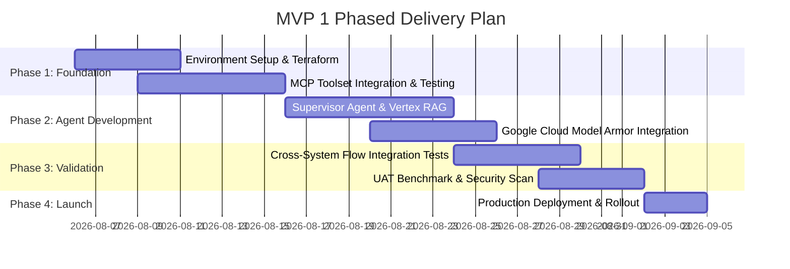

## **7.2. CI/CD Environment Promotion Pipeline**

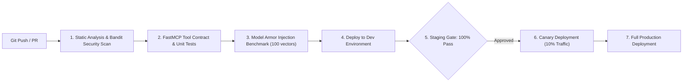

* **Automated Quality Gates**:
  1. Zero high/critical Bandit / Semgrep static analysis vulnerabilities.
  2. 100% pass rate on FastMCP tool contract tests (`pytest`).
  3. 100% detection rate on Model Armor prompt injection regression test suite.

## **7.3. Infrastructure as Code (IaC) Terraform Repository Structure**

```
terraform/
├── modules/
│   ├── agent_runtime/         # Agent Platform, Session Service, Supervisor Agent
│   ├── model_armor/           # Model Armor Templates, Prompt Injection & PII Rules
│   ├── fast_mcp_servers/      # Cloud Run WorkWeek & ServiceImmediately Services
│   ├── vertex_search/         # Vertex AI Agent Builder Policy Store & Data Stores
│   └── networking_security/   # IAP, Cloud Armor, Service Accounts & KMS Keys
└── environments/
    ├── dev/                   # Development environment backend config & variables
    ├── staging/               # Staging environment config with canary rules
    └── prod/                  # Production multi-region deployment terraform state
```

---

# **8\. Assumptions, Constraints, Risk & Mitigations**

## **8.1. Assumptions**

Each assumption is stated so it can be **falsified**. If one proves false, the linked design section must be revisited before build.

| # | Assumption | If false, revisit | Validated by / when |
| :-- | :--- | :--- | :--- |
| **A-1** | The mock enterprise services behave per `enterprise_services_openapi.json`, including the `New -> Closed` rejection and the 5-minute duplicate window. | §5.1, §5.2 | Contract tests in Phase 1 (§7.1) |
| **A-2** | FastMCP tool names and argument names are identical to the REST field names in the OpenAPI file. The OpenAPI document specifies REST paths only; the MCP surface is **not** machine-documented. | §5.1 | MCP `tools/list` probe on day 1 of Phase 1 — **highest-risk assumption in this document** |
| **A-3** | The HR policy corpus is < 1,000 documents of static PDF/TXT, no access-controlled subsets. | §1.2, §4.4.1 | Corpus inventory from HR before Phase 2 |
| **A-4** | Every user of MVP 1 has exactly one WorkWeek `employee_id` resolvable from their corporate email. | §3.6, §4.2 | Directory sample of 100 users, Phase 1 |
| **A-5** | Traffic is ≤ 10,000 MAU / 90k turns per month and is business-hours weighted (peak ≈ 6× mean). | §5.3, §6.2 | HR helpdesk volume baseline, Phase 1 |
| **A-6** | Model Armor round-trip stays within the 300 ms turn budget for prompts ≤ 4 KB. | §5.7, `NFR-2.1` | Latency probe in Phase 2, before agent integration |
| **A-7** | Gemini Flash-tier quality is sufficient for intent routing and grounded summarisation at the `NFR-3.1` accuracy bar. | §6.1, §9 | 100-question eval set, Phase 3 — fallback is a Pro-tier model, which multiplies `C_LLM` by ≈8× |
| **A-8** | No employee data must remain in-region for EU/UK subjects during MVP 1 (test data only). | §4.8, `D-10` | DPO sign-off before any production data is loaded |

## **8.2. Constraints**

| # | Constraint | Consequence |
| :-- | :--- | :--- |
| **C-1** | `BRD §6` — functional test credentials only, no SSO/Okta/AD. | Single-role authorization (§4.4.1); the four-role matrix is future state. |
| **C-2** | `BRD §6` — single tenant. | No tenant dimension in session, log, or datastore schemas. |
| **C-3** | FastMCP requires the custom `X-MCP-Token` header because backend services sit behind GFE and bypass IAP. | Token stored in Secret Manager and injected at runtime (§4.1); never committed. |
| **C-4** | `BRD §2.3` — no multi-lingual support. | Non-English prompts are answered in English or politely refused; no translation layer. |

## **8.3. Risks & Mitigations**

| # | Risk | Likelihood × Impact | Mitigation | Owner |
| :-- | :--- | :---: | :--- | :--- |
| **R-1** | MCP tool signatures differ from the REST contract (`A-2` false), invalidating §5.1. | Med × High | Probe `tools/list` on day 1; §5.1 is generated from the probe output, not hand-written. | Integration lead |
| **R-2** | Duplicate ticket submission during retry storms. | Med × Med | Server-side 5-minute dedup window on identical `short_description` + `requested_by` (`FR-4.3`); client retries are idempotent by construction. | Integration lead |
| **R-3** | Latency breach (>10 s) from serialised tool calls in `UC-2.x`. | Med × High | Independent calls run under `asyncio.gather`; policy retrieval and profile fetch overlap (`NFR-2.3`). Budget in §5.7. | Agent lead |
| **R-4** | Prompt injection embedded **in a policy document** (indirect injection) reaches the model through RAG. | Low × High | Retrieved chunks are wrapped as untrusted data with delimiters; the system prompt forbids executing instructions found in retrieved content; §3.5 confirmation blocks any resulting mutation. | Security lead |
| **R-5** | Partial cross-system failure leaves enterprise state inconsistent (`NFR-4.3`). | Med × High | Confirmation lists all mutations up front; failures emit a reference ID and a DLQ entry; §5.2 defines the user message. | Agent lead |
| **R-6** | MVP cannot meet `NFR-2.2` 99.9% (see §5.6). | High × Med | Restate MVP target to 99.5% + per-capability degradation; dual-region before production. | Architecture lead |
| **R-7** | Policy corpus contains stale or contradictory documents, producing confidently wrong grounded answers. | Med × High | Citation resolver surfaces the document and version; HR owns corpus currency; eval set includes known-contradiction cases. | HR content owner |
| **R-8** | EU/UK data residency breach once real employee data is loaded (§4.8). | Med × High | Test data only until DPO sign-off; EU-region deployment option costed before production. | DPO |

## **8.4. SLA Targets Derived from the BRD**

| Target | Source | Design commitment |
| :--- | :--- | :--- |
| Policy document sync latency | `FR-5.5` (BRD leaves `[X]` blank) | 15 minutes, via Cloud Storage → Eventarc → Vertex AI Search incremental import. **This value is a design proposal and needs business sign-off — see `D-11`.** |
| Response start latency | `NFR-2.1` | < 10 s p95; safety overhead < 300 ms/turn, decomposed in §5.7 |
| Availability | `NFR-2.2` | See §5.6 — 99.9% not achievable single-region; `D-9` open |

---

# **9\. Quality Evaluation & UAT Framework**

| Evaluation Category | Target Metric / Benchmark | Verification Method |
| :--- | :--- | :--- |
| **Policy Q&A Accuracy** | $\ge 95\%$ accuracy; 0% policy hallucinated | Run 100-question ground-truth evaluation set via LLM-as-judge (`NFR-3.1`). |
| **Transaction Integrity** | $100\%$ transaction correctness | Automated test suite verifying WorkWeek & ServiceImmediately DB state changes. |
| **Prompt Injection Defense** | $100\%$ detection of jailbreak test cases | Execute OWASP LLM Top 10 benchmark injection attacks via Model Armor (`FR-1.3`). |
| **Response Latency** | $< 10.0\text{s}$ average response time; safety overhead $< 300\text{ms}$ | Latency tracing via Cloud Trace telemetry (`NFR-2.1`). |
| **Audit Log Coverage** | $100\%$ coverage of actions with origin metadata | Log audit parser verifying `automation_source` fields in BigQuery (`FR-1.2`, `NFR-1.2`). |

---

# **10\. Assumptions / Open Questions**

Assumptions live in §8.1. This section tracks **decisions**: those already closed, and those still open with a named owner and a date by which the build is blocked.

## **10.1. Closed Decisions**

| # | Topic | Confirmed Selection | Status |
| :- | :--- | :--- | :--- |
| **D-1** | Partial cross-system failure | Log with a tracking reference ID, notify the user with manual follow-up instructions, emit a DLQ entry (`NFR-4.3`, §5.2/§5.4). | Approved |
| **D-2** | MCP token credentials | Service PAT in `X-MCP-Token`, sourced from Secret Manager at runtime; user `employee_id` derived server-side from the IAP assertion, never from the client (`FR-3.1`, §3.6/§4.1). | Approved |
| **D-3** | Safety interceptor | **Google Cloud Model Armor** for injection, jailbreak, RAI and SPII (`FR-1.3`, `FR-1.4`). Grounding is explicitly **not** in its scope — see D-12. | Approved |
| **D-4** | Knowledge base (RAG) | **Vertex AI Search / Agent Builder** with Cloud Storage ingestion, semantic chunking, deep links (`FR-5.1`–`FR-5.5`). | Approved |
| **D-5** | Session memory state | **Agent Runtime Session Service** for multi-turn state (`FR-2.2`). | Approved |
| **D-12** | Anti-hallucination control | **Vertex AI `check_grounding`** + citation resolver at `support_score ≥ 0.7`, separate from Model Armor (§4.3.1, `FR-5.2`, `NFR-3.1`). | Approved (v1.4) |
| **D-13** | Write-action safety | Every mutating tool requires an explicit confirmation turn with payload pinning (§3.5). | Approved (v1.5) |
| **D-14** | MVP authorization model | Single role, self-scoped, enforced server-side; multi-role RBAC deferred to production (§4.4.1/§4.4.2, `C-1`). | Approved (v1.4) |

## **10.2. Open Decisions — blocking, with owners**

| # | Question | Why it blocks | Owner | Needed by | Status |
| :- | :--- | :--- | :--- | :--- | :--- |
| **D-9** | Do we accept **99.5%** as the MVP 1 availability target, or fund dual-region now? §5.6 shows 99.9% is unreachable single-region. | Determines whether §2.2 work lands in MVP or production phase; changes runtime cost ≈2×. | Architecture lead + Business sponsor | End of Phase 1 | **Open** |
| **D-10** | **Data residency** for EU/UK subjects (`UC-2.3` London). US-region processing needs SCCs or an EU deployment. | Blocks loading any real employee data; may force a region change that invalidates §7.3 state. | DPO | Before Phase 3 UAT | **Open** |
| **D-8** | **DPIA** completion and sign-off. | Regulatory precondition for production rollout with real data. | DPO | Before production | **Open** |
| **D-11** | Confirm **15 minutes** as the `FR-5.5` policy-sync SLA (BRD leaves `[X]` blank). | Drives the ingestion trigger design and HR's publishing workflow expectations. | HR content owner | End of Phase 1 | **Open** |
| **D-6** | Re-validate **unit prices** in §6 against the current price list. | The business case, not the build. | FinOps | Before production business case | **Open** |
| **D-15** | Does the FastMCP surface expose the **exact tool names and argument names** assumed in §5.1? `enterprise_services_openapi.json` documents REST only (`A-2`). | §5.1 is the implementation contract; if it is wrong every tool call fails. **Highest-risk open item.** | Integration lead | **Day 1 of Phase 1** | **Open** |
| **D-16** | Which **Gemini tier** clears the `NFR-3.1` bar (`A-7`)? | Flash vs Pro changes `C_LLM` ≈8× and the latency budget in §5.7. | Agent lead | End of Phase 2 | **Open** |

---

# **Appendix A — BRD Requirement Traceability Matrix**

Every requirement in `BRD.md` is listed. `Design §` points at the section of this document that specifies *how* the requirement is met; `Verified by` names the artefact that proves it. A requirement with no design section is an open gap and is tracked in §10.

## **A.1. Functional Requirements**

| BRD ID | Requirement | Design § | Verified by |
| :--- | :--- | :--- | :--- |
| **FR-1.1** | Capability & lifecycle governance | §4.7 (manifest, deny-by-default callback, version/owner labels) | CI gate: manifest vs deployment labels; denied-tool probe emits `governance.tool_denied` (§9) |
| **FR-1.2** | Verification of request origin | §4.1, §4.3 control 6 | Audit log parser asserts `automation_source` on 100% of tool calls (§9) |
| **FR-1.3** | Verification of conversation safety | §4.3 controls 1–2, §4.5 | OWASP LLM Top-10 injection suite, 100% detection (§9) |
| **FR-1.4** | Data masking / redaction | §4.3 control 3, §4.5, §3.3 ERD | SPII scanner over BigQuery audit sink returns zero unmasked matches (§9) |
| **FR-1.5** | RBAC and data isolation | §4.2, §4.4.1 | Cross-tenant probe suite: every foreign `employee_id` returns `403` (§9) |
| **FR-2.1** | Natural language understanding | §3.1, §3.6 | NLU robustness set (typos/synonyms/ellipsis) qualitative pass (§9) |
| **FR-2.2** | Multi-turn dialog | §1.4, §3.4 | Multi-turn regression suite; session isolation assertion (§9) |
| **FR-3.1** | Delegated authorization | §4.1, §4.2 | Identity-mismatch probe returns `403` (§9) |
| **FR-3.2** | WorkWeek core actions | §5.1.1 | FastMCP tool contract tests against `enterprise_services_openapi.json` (§7.2) |
| **FR-3.3** | WorkWeek operation guardrails | §5.1.1, §5.2 | Boundary suite: over-balance, inverted dates, past dates, bad phone format (§9) |
| **FR-3.4** | Real-time data fetch (no caching) | §4.2 | Cache-inspection test: two consecutive queries produce two backend calls (§9) |
| **FR-4.1** | Auditable ticket creation | §4.3 control 6 | Every `create_ticket` log row carries `automation_source` (§9) |
| **FR-4.2** | Status tracking & ticket management | §5.1.2, §4.4.1 | Tool contract tests + `UC-1.3` end-to-end (§9) |
| **FR-4.3** | ServiceImmediately guardrails | §5.1.2, §5.1.3 | State-machine matrix test incl. `New -> Closed` rejection; 5-min duplicate window; priority-keyword check (§9) |
| **FR-5.1** | Document ingestion | §1.2, §7.3 (`vertex_search` module) | Datastore document count matches source bucket (§9) |
| **FR-5.2** | Grounded answers | §4.3.1 | `check_grounding` threshold test; refusal on out-of-corpus questions (§9) |
| **FR-5.3** | Source citation | §4.3.1 citation resolver | Every policy answer carries $\ge 1$ resolvable deep link (§9) |
| **FR-5.4** | Policy retrieval guardrails | §4.3 control 1, §4.3.1 | Off-topic denylist suite; dead-citation injection test (§9) |
| **FR-5.5** | Document sync latency | §8 (15-minute SLA) | Timed ingestion probe: upload → searchable $\le 15$ min (§9) |

## **A.2. Non-Functional Requirements**

| BRD ID | Requirement | Design § | Verified by |
| :--- | :--- | :--- | :--- |
| **NFR-1.1** | Safety for AI interactions | §4.3 controls 1–2 | RAI + jailbreak suite (§9) |
| **NFR-1.2** | Audit logging (incl. denied actions) | §4.3 control 6 | Log-coverage parser: allowed **and** blocked events both present (§9) |
| **NFR-1.3** | Compliance adherence (GDPR, labour law) | §4.8, §4.6 | DPO sign-off checklist; Art. 17 purge drill; residency decision `D-10` (§9) |
| **NFR-2.1** | Latency (<10 s; safety <300 ms) | §5.7 (decomposed budget), §5.3 | Cloud Trace p50/p95 per-span budget assertion (§9) |
| **NFR-2.2** | Availability 99.9% | §5.6 (budget, options, degradation modes) | Per-capability availability SLI (§9). **Target contested — see `D-9`** |
| **NFR-2.3** | Asynchronous processing | §5.7 (`asyncio.gather` mandate), §5.4, §3.6 SSE | Parallel-tool-call trace shows overlapping spans (§9) |
| **NFR-3.1** | Accuracy $\ge 95\%$, 0% hallucination | §4.3.1, §9 | 100-question ground-truth set, LLM-as-judge (§9) |
| **NFR-4.1** | Graceful failure handling | §5.2 | Fault-injection: no stack trace or internal code reaches the user (§9) |
| **NFR-4.2** | Transient fault tolerance | §5.3 | Injected `429`/`503`: exactly 3 retries with jittered backoff (§9) |
| **NFR-4.3** | Orchestration consistency | §5.2, §5.4 | Partial-failure drill: reference ID emitted and DLQ row created (§9) |

## **A.3. Use Case Coverage**

| BRD Use Case | Sequence diagram | Systems exercised |
| :--- | :--- | :--- |
| **UC-1.1** Policy Q&A | §3.2 | Vertex AI Search |
| **UC-1.2** HR self-service (PTO) | §3.2 | WorkWeek |
| **UC-1.3** IT incident management | §3.2 | ServiceImmediately |
| **UC-2.1** Equipment procurement | §3.2 | Policy + WorkWeek + ServiceImmediately |
| **UC-2.2** Short-term medical leave | §3.2 | Policy + WorkWeek + ServiceImmediately |
| **UC-2.3** Relocation | §3.2 | Policy + WorkWeek + ServiceImmediately |

**Coverage status at v1.5: 29 / 29 requirements have a named design section and a named verification artefact.** Three carry open *decisions* rather than design gaps: `NFR-2.2` (target contested, `D-9`), `NFR-1.3` (DPIA + residency, `D-8`/`D-10`), `FR-5.5` (SLA value needs business sign-off, `D-11`).
