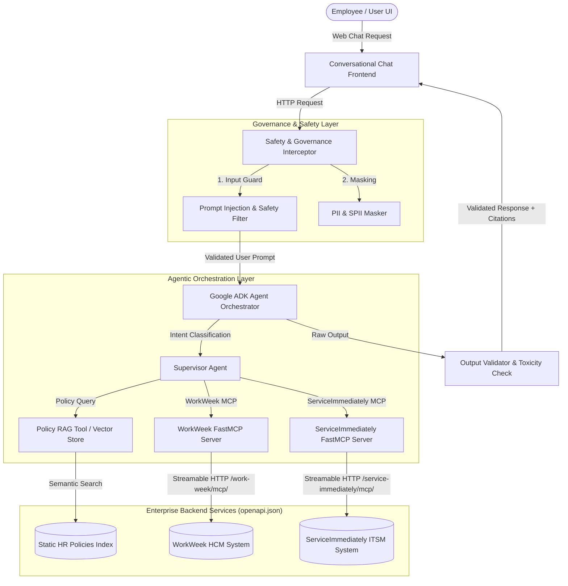
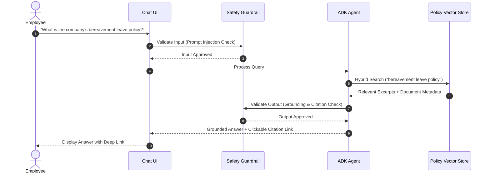
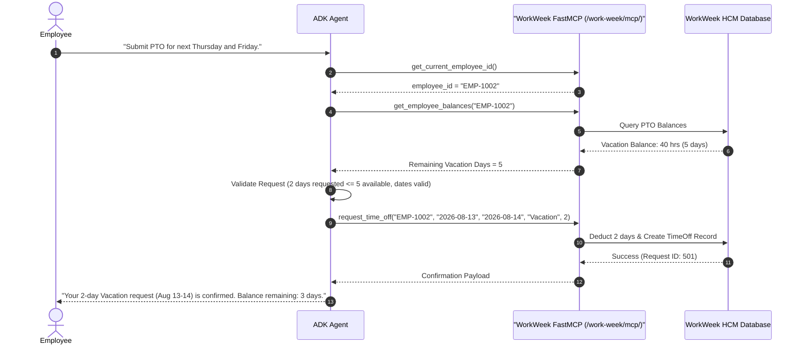
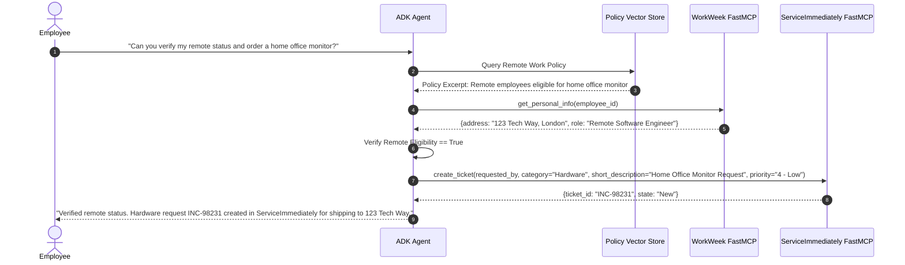
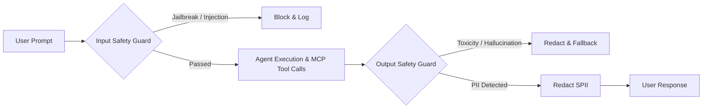
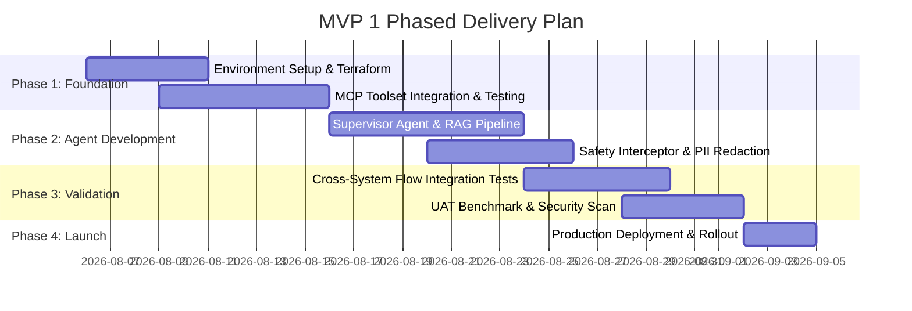

# **MVP SOLUTION DESIGN DOCUMENT**

# **Document Control**

## **Document Metadata**

| Field | Value |
| :---- | :---- |
| Author(s) | Solution Architecture Team |
| Date | 2026-08-05 |
| Status | Approved |
| Target Audience | Enterprise Architecture, HR Engineering, IT Operations, Security & Compliance |

## **Revision History**

| Version | Date | Author | Description of Change |
| :---- | :---- | :---- | :---- |
| 0.1 | 2026-08-05 | Solution Architecture Team | Initial outline setup |
| 1.0 | 2026-08-05 | Solution Architecture Team | Complete MVP 1 design incorporating FastMCP integration specs from `openapi.json` |

---

# **1. Executive Summary & Scope Boundaries**

## **1.1. Business Overview & Context**
Enterprise employees currently experience friction and high turnaround times when navigating disconnected backend UIs (WorkWeek for HCM, ServiceImmediately for ITSM) and static HR policy repositories. Simultaneously, HR and IT helpdesks face significant Tier 1 ticket loads for routine queries. 

The **HR Agentic Solution (MVP 1)** introduces a secure, AI-driven virtual assistant designed to:
* **Deflect Tier 1 HR/IT Inquiries:** Achieve a $\ge 40\%$ reduction in routine ticket volume within 6 months.
* **Enable Conversational Transactions:** Execute core self-service actions (leave submission, contact updates, ticket tracking) conversationally.
* **Demonstrate Cross-System Orchestration:** Multi-step intent resolution chaining Policy RAG, WorkWeek HCM, and ServiceImmediately ITSM.
* **Enforce Zero-Trust AI Security:** Guarantee 100% auditability, bounded tool execution via MCP, prompt injection interception, and zero policy/data leakage.

## **1.2. Scope Boundaries**

| Feature / Domain | In-Scope (MVP 1) | Out-of-Scope (MVP 1) |
| :--- | :--- | :--- |
| **User Interface** | Web-based Chat Interface / Enterprise Chat Integration | Voice UI, native mobile apps |
| **Knowledge Base** | Static HR Policy Docs (Leave, Expense, Remote Work, Code of Conduct) | Dynamic intranet pages, uncategorized docs |
| **HCM Integration** | **WorkWeek via FastMCP**: Profile metadata, PTO balance check, Leave booking/cancellation, Address/Phone update | Payroll processing, performance reviews, compensation data |
| **ITSM Integration** | **ServiceImmediately via FastMCP**: Ticket status/details query, Incident ticket creation, Comment timeline, Status lifecycle updates | Change management, asset management, IT provisioning |
| **Orchestration** | Multi-system workflows (UC-2.1 Equipment, UC-2.2 Medical Leave, UC-2.3 Relocation) | Third-party ERPs, CRM integrations |
| **Security & Auth** | Custom `X-MCP-Token` header authentication, tenant isolation by Employee ID, regex/model safety guardrails | Full Enterprise SSO / Okta SAML (future state) |

## **1.3. Target Architecture Overview**

The solution leverages Google ADK (Agent Development Kit) with Streamable HTTP FastMCP toolsets (`McpToolset`), wrapped in an Input/Output Safety Interceptor pipeline.



## **1.4. Alternatives Considered**

| Architectural Pattern | Evaluated Alternative | Selected Choice & Rationale |
| :--- | :--- | :--- |
| **Backend Integration** | Direct REST Endpoint Calling | **Streamable HTTP MCP Servers (`FastMCP`)**: Provides standardized tool discovery, strict type schema enforcement, stateless transport, and built-in ADK compatibility via `McpToolset`. |
| **Agent Framework** | Monolithic Prompt / LangChain | **Google ADK Agentic Framework**: Native support for `StreamableHTTPConnectionParams`, robust state management, and enterprise-grade telemetry. |
| **Safety Interceptor** | In-Prompt Guardrails | **Standalone Interceptor Pipeline**: In-prompt rules are vulnerable to jailbreaking. Separate input/output scanning guarantees deterministic interception without polluting agent context. |

---

# **2. Production-Ready Future State Design**

The production target architecture expands MVP 1 into a highly scalable, enterprise-grade deployment:
1. **Identity & Auth Federation**: Transition from `X-MCP-Token` header authentication to Enterprise SSO (Okta / Entra ID) via Google Cloud Identity-Aware Proxy (IAP), automatically injecting `x-goog-authenticated-user-email` headers.
2. **Multi-Tenancy & Fleet Management**: Scale MCP server instances using Google Cloud Run with auto-scaling (0-100 instances), registered in Agent Registry for enterprise fleet management.
3. **Dynamic Knowledge Base Sync**: Replace static policy document indexing with an automated Event-Driven Document Sync pipeline (Cloud Storage trigger $\rightarrow$ Document AI $\rightarrow$ Vertex AI Vector Search) achieving sub-15 minute sync SLAs.
4. **Asynchronous Streaming**: Implement Server-Sent Events (SSE) / WebSockets for real-time response streaming to reduce perceived latency below $1.5\text{s}$.

---

# **3. System Flows, Sequence Diagrams & Agent Design**

## **3.1. Agent Design**
The core system uses a **Supervisor Agent** orchestrating three specialized tool sets:
* **Policy RAG Tool**: Performs hybrid dense-sparse vector search against HR policies, returning grounded answers with metadata citations.
* **WorkWeek MCP Toolset** (`/work-week/mcp/`): Exposes `get_current_employee_id`, `get_employee_balances`, `request_time_off`, `update_personal_info`, `get_personal_info`, and `cancel_leave_request`.
* **ServiceImmediately MCP Toolset** (`/service-immediately/mcp/`): Exposes `list_tickets`, `create_ticket`, `add_ticket_comment`, and `update_ticket_status`.

---

## **3.2. Sequence Diagrams**

### **UC-1.1: Policy Q&A Flow**


### **UC-1.2: HR Self-Service - PTO Submission**


### **UC-2.1: Cross-System Orchestration - Equipment Procurement**


---

# **4. Security, Governance & Identity**

## **4.1. Authentication Boundaries**
In production, backend services bypass IAP and require a custom **Personal Access Token (PAT)** header to satisfy Google Frontend (GFE) proxy requirements:
```http
X-MCP-Token: mcp_your_token_here
```

ADK agents configure connection parameters statelessly using custom HTTP headers:
```python
from google.adk.agents import Agent
from google.adk.tools.mcp_tool import McpToolset
from google.adk.tools.mcp_tool.mcp_session_manager import StreamableHTTPConnectionParams

workweek_mcp = McpToolset(
    connection_params=StreamableHTTPConnectionParams(
        url="https://mock-saas.aishprabhat.demo.altostrat.com/work-week/mcp/",
        headers={"X-MCP-Token": "mcp_your_token_here"}
    )
)

serviceimmediately_mcp = McpToolset(
    connection_params=StreamableHTTPConnectionParams(
        url="https://mock-saas.aishprabhat.demo.altostrat.com/service-immediately/mcp/",
        headers={"X-MCP-Token": "mcp_your_token_here"}
    )
)
```

## **4.2. Tenant Isolation Rules**
* **Identity Context Verification**: Every FastMCP resource query (`workweek://employees/{employee_id}/profile`) and tool call (`get_employee_balances`) verifies caller identity against the authenticated session context.
* **Cross-User Data Block**: Users attempting to pass another user's `employee_id` will receive an immediate `403 Forbidden` / access denied error.

## **4.3. Safety Interceptor Pipeline & Guardrails**



1. **Input Validation (`FR-1.3`)**: Regex and classifier models intercept jailbreaks, system prompt overrides, and off-topic queries.
2. **Output Validation (`FR-1.3`)**: Validates model output against grounded retrieved context to guarantee 0% hallucinated policies.
3. **Data Masking (`FR-1.4`)**: Redacts SSNs, phone numbers, and addresses from application log files using Named Entity Recognition (NER) and regex.
4. **Audit Logging (`FR-1.2`, `NFR-1.2`)**: Logs all tool calls with `automation_source: "Agentic_HR_Assistant"`, caller ID, execution status, and timestamp.

---

# **5. Integration Details & Error Handling**

## **5.1. FastMCP Tool Specifications**

### **1. WorkWeek FastMCP Server (`/work-week/mcp/`)**

| Tool Name | Parameters | Description & Validation Rules |
| :--- | :--- | :--- |
| `get_current_employee_id()` | None | Resolves the authenticated user's `employee_id`. |
| `get_employee_balances` | `employee_id: str` | Returns accrued, used, and remaining Vacation/Sick leave balances. |
| `request_time_off` | `employee_id: str`, `start_date: str`, `end_date: str`, `leave_type: str`, `days: float` | Books time off. Dates must be `YYYY-MM-DD`. Validates $start \le end$, start $\ge$ today, and $days \le remaining\_balance$. |
| `update_personal_info` | `employee_id: str`, `address: str`, `phone: str` | Updates home address ($\ge 5$ chars) and phone number (regex `^\+?[\d\s\-()]{7,20}$`). |
| `get_personal_info` | `employee_id: str` | Retrieves personal address and phone details. |
| `cancel_leave_request` | `employee_id: str`, `request_id: int` | Cancels a pending/approved request and refunds remaining leave days. |

### **2. ServiceImmediately FastMCP Server (`/service-immediately/mcp/`)**

| Tool Name | Parameters | Description & Validation Rules |
| :--- | :--- | :--- |
| `list_tickets` | `employee_id: str` | Retrieves all incident tickets requested by the employee. |
| `create_ticket` | `requested_by: str`, `category: str`, `short_description: str`, `priority: str`, `assignment_group: str` | Creates incident. Rejects duplicate submissions within 5 mins. Priority `'1 - Critical'` requires outage/downtime keywords. |
| `add_ticket_comment` | `ticket_id: str`, `author: str`, `comment: str` | Appends comment to ticket activity log timeline. |
| `update_ticket_status` | `ticket_id: str`, `status: str`, `resolution_notes: str`, `updated_by: str` | Enforces state machine: `New -> In Progress/Closed`, `In Progress -> Resolved/Closed`, `Resolved -> In Progress/Closed`. Closed tickets are immutable. |

---

## **5.2. Error Handling & Fallback Matrix**

| Failure Scenario | Root Cause | Fallback Behavior & User Message |
| :--- | :--- | :--- |
| **Transient Network Timeout / 5xx** | Backend service glitch | Automatic exponential backoff retry (up to 3 attempts). If persistent: *"WorkWeek is temporarily unavailable. Please try again shortly."* |
| **Insufficient PTO Balance** | Business rule violation | Agent intercepts error: *"Request declined: You requested 5 days, but only have 2 days remaining."* |
| **Invalid Ticket State Transition** | State machine violation | Agent catches state rule: *"Ticket INC-123 is Closed and cannot be updated."* |
| **Partial Cross-System Failure** | Step 1 succeeds, Step 2 fails | Saga transaction log records failure. User notified: *"Leave request submitted in WorkWeek, but ticket creation in ServiceImmediately failed. Reference ID: LOG-8812."* |

---

# **6. Cost Estimation & FinOps**

| Variable | Cost Driver | Optimization Strategy |
| :--- | :--- | :--- |
| **Model Inference** | Gemini 3.5 / 3.6 Flash input/output token usage | Prompt caching for policy system prompts; concise system instructions. |
| **Vector Storage** | Embedding storage and search queries | Chunk size optimization (500 tokens with 50 token overlap); hybrid vector index. |
| **MCP Compute** | Cloud Run CPU/Memory per HTTP request | Scale-to-zero Cloud Run instances during off-peak hours. |
| **Safety Interceptor** | Dual-pass guardrail evaluation | Lightweight regex filters before executing heavy model-based classifiers. |

---

# **7. Deployment & Delivery Plan**



---

# **8. Assumptions, Constraints, Risk & Mitigations**

| Category | Risk / Constraint | Mitigation Strategy |
| :--- | :--- | :--- |
| **Constraint** | FastMCP headers require `X-MCP-Token` due to GFE proxy rules. | Pre-configure `StreamableHTTPConnectionParams` with exact header specs in ADK config. |
| **Risk** | Duplicate ticket submission during network retries. | FastMCP server enforces 5-minute deduplication window on identical short descriptions. |
| **Risk** | Latency breach ($>10\text{s}$) due to sequential tool calls. | Execute independent tool calls asynchronously using Python `asyncio.gather`. |
| **Assumption** | Policy documents remain static during MVP 1. | Knowledge base manual re-index script provided for scheduled updates (`FR-5.5`). |

---

# **9. Quality Evaluation & UAT Framework**

| Evaluation Category | Target Metric / Benchmark | Verification Method |
| :--- | :--- | :--- |
| **Policy Q&A Accuracy** | $\ge 95\%$ accuracy; 0% policy hallucination | Run 100-question ground-truth evaluation set via LLM-as-judge. |
| **Transaction Integrity** | $100\%$ transaction correctness | Automated test suite verifying WorkWeek & ServiceImmediately DB state changes. |
| **Prompt Injection Defense** | $100\%$ detection of jailbreak test cases | Execute OWASP LLM Top 10 benchmark injection attacks. |
| **Response Latency** | $< 10.0\text{s}$ average response time; safety overhead $< 300\text{ms}$ | Latency tracing via Cloud Trace telemetry. |
| **Audit Log Coverage** | $100\%$ coverage of actions with origin metadata | Log audit parser verifying `automation_source` fields in BigQuery. |

---

# **10. Assumptions / Open Questions**

| # | Assumption / Question | Owner | Status / Target Date |
| :- | :--- | :--- | :--- |
| **A-1** | `X-MCP-Token` credentials will be provisioned per test environment. | Security Team | Approved |
| **A-2** | Policy document repository updates occur at most once per week in MVP 1. | HR Ops | Approved |
| **Q-1** | Should failed cross-system steps trigger an automatic rollback (e.g. canceling leave if ticket fails)? | HR / Tech Lead | Open (Currently logging for manual follow-up per `NFR-4.3`) |