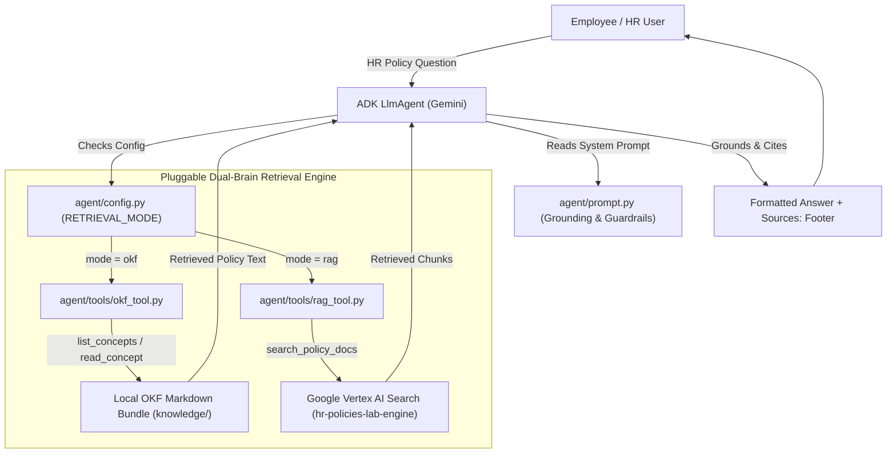
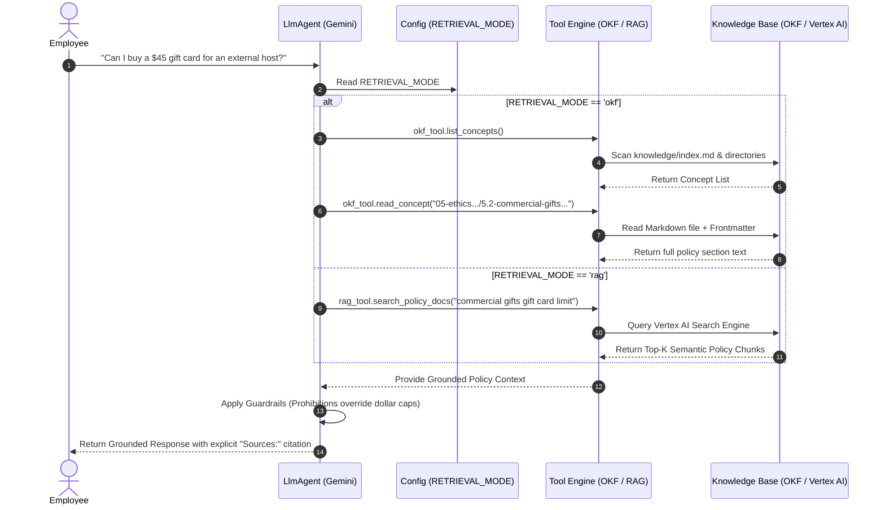
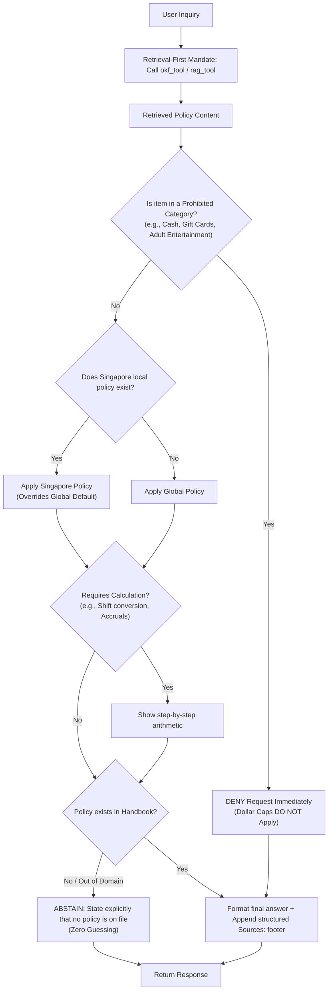

# Software Design Document (SDD): Project Elevate — Altostrat Singapore HR Policy Assistant

**Document Status:** Final Approved Design  
**Author:** AI Agent Architecture Team  
**Date:** 2026-08-04  
**Version:** 1.0.0  
**Target System:** Google ADK `LlmAgent` with Pluggable Dual-Brain Retrieval (`OKF` / `RAG`)

---

## 1. Executive Summary & Business Context

### 1.1 Problem Statement
Altostrat Singapore employs a diverse workforce (full-time staff, interns, and extended workforce) governed by a 52-page *Employee Policy Handbook & Conduct Guidelines* (`data/handbook.pdf`). Currently, HR teams are bottlenecked by repetitive employee inquiries regarding policies such as sick time, vacation accruals, travel expense caps, and business gifts. Employees rarely read the full 52-page PDF, leading to inconsistent HR guidance and significant legal and compliance risks—especially when "gotcha" rules apply (e.g., categorical prohibitions overriding dollar limits).

### 1.2 Business Objectives
**Project Elevate** deploys an authoritative, conversational AI HR Policy Assistant that:
- Delivers **100% grounded answers** derived strictly from the Altostrat Singapore Employee Policy Handbook.
- Provides **explicit citations** (section number and title) for every factual claim.
- **Refuses out-of-domain queries** and explicitly abstains when no policy exists, eliminating hallucinated HR advice.
- Enforces complex compliance rules, including jurisdictional hierarchy (Singapore local rules override global defaults) and categorical prohibitions.

### 1.3 Scope, Goals & Non-Goals
* **In-Scope Goals:**
  * Support a **Pluggable Dual-Brain Architecture** (`OKF`, `RAG`, and `Hybrid` modes) controlled via environment variables (`RETRIEVAL_MODE`).
  * Enforce strict prompt-level guardrails for gotchas and multi-step mathematical reasoning.
  * Validate agent performance using an automated 5-dimension evaluation rubric (`evals/RUBRICS.md`).
* **Non-Goals (Out of Scope):**
  * Modifying HR policies or executing transactional HR updates (e.g., booking time off or submitting expense reports).
  * Utilizing external web search or general pre-trained knowledge to answer policy inquiries.

### 1.4 Definitions & Acronyms
| Term / Acronym | Definition |
|---|---|
| **BRD** | Business Requirements Document |
| **SDD** | Software Design Document |
| **ADK** | Google Agent Development Kit |
| **OKF** | Open Knowledge Format — cross-linked markdown bundles with YAML frontmatter |
| **RAG** | Retrieval-Augmented Generation — vector/semantic search via Google Vertex AI Search |
| **TOIL** | Time Off In Lieu |
| **WSH** | Workplace Safety and Health |

---

## 2. System Overview & High-Level Architecture

### 2.1 Architectural Approach
Project Elevate decouples the conversational reasoning engine (Google ADK `LlmAgent` powered by Gemini) from the retrieval layer ("The Brain"). Using a **Pluggable Dual-Brain Architecture**, the agent can switch between two retrieval backends without changing the prompt or orchestration logic:
1. **Track B — OKF (Open Knowledge Format):** Deliberate graph navigation over structured markdown files (`knowledge/`). Zero cloud dependency; deterministic concept traversal.
2. **Track A — RAG (Vertex AI Search):** Semantic search over the indexed 52-page PDF (`data/handbook.pdf`) hosted in Google Cloud Vertex AI Search.

### 2.2 High-Level Architecture Diagram



### 2.3 End-to-End Request/Response Flow



---

## 3. Component & API Design

### 3.1 Orchestration Engine (`LlmAgent` & `agent/agent.py`)
- **Responsibility:** Orchestrates user interactions, tool dispatching, context window management, and response synthesis.
- **Specification:** Constructed using Google ADK `LlmAgent`. Injects `POLICY_AGENT_PROMPT` from `agent/prompt.py` and binds tools dynamically based on `RETRIEVAL_MODE`.

### 3.2 Retrieval Brain Track B — OKF Tool (`agent/tools/okf_tool.py`)
- **Purpose:** Provides deterministic, graph-style navigation across structured policy concepts.
- **Tool APIs Exposed:**
  1. `list_concepts()`
     - **Input:** None (or optional section filter).
     - **Output:** JSON list of available concept IDs, section titles, and file paths.
  2. `read_concept(concept_id: str)`
     - **Input:** `concept_id` (e.g., `"01-paid-time-off-leave-operations/1.2-paid-vacation-leave-singapore.md"`).
     - **Output:** Full text of the markdown concept, including YAML frontmatter (`title`, `section`, `source`).

### 3.3 Retrieval Brain Track A — RAG Tool (`agent/tools/rag_tool.py`)
- **Purpose:** Semantic similarity retrieval over unstructured policy documentation.
- **Tool APIs Exposed:**
  1. `search_policy_docs(query: str, top_k: int = 5)`
     - **Input:** Natural language search query.
     - **Output:** List of matching document snippets with metadata (page number, section title, relevance score).

### 3.4 Configuration Subsystem (`agent/config.py`)
- **Environment Switches:**
  - `GEMINI_MODEL`: Specifies model version (e.g., `"gemini-3.5-flash"`).
  - `RETRIEVAL_MODE`: Swaps active tools between `"okf"`, `"rag"`, or `"hybrid"`.
  - `GOOGLE_CLOUD_PROJECT`, `VERTEX_AI_DATA_STORE_ID`, `VERTEX_AI_SEARCH_ENGINE_ID`: Vertex AI Search bindings.

---

## 4. Prompt Engineering & Compliance Guardrails (`agent/prompt.py`)

To satisfy business compliance rules without hardcoding fragile regex filters, guardrails are architected directly into `POLICY_AGENT_PROMPT`:



### 4.1 Strict Guardrail Rules
1. **Retrieval-First Mandate:** The agent must never answer from pre-trained weights; it must invoke retrieval tools before responding.
2. **Prohibitions Override Thresholds:** Categorical prohibitions (e.g., gift cards, adult entertainment) take precedence over general spending thresholds (e.g., $50 host gifts).
3. **Singapore Jurisdiction Hierarchy:** Singapore-specific handbook sections (e.g., Singapore Shared Parental Leave, TOIL) override global default sections.
4. **Strict Abstention Protocol:** If an inquiry is out of domain (e.g., programming help, personal tax advice) or if no policy is on file, the agent must explicitly state so without guessing.
5. **Mandatory Citation Footer:** Every response must terminate with a structured footer:
   ```markdown
   Sources:
   - Section <Number>: <Section Title>
   ```

---

## 5. Data Model & Knowledge Storage Architecture

### 5.1 Single Source of Truth
- The master corporate policy resides in `data/handbook.pdf` (52-page Altostrat Singapore Employee Policy Handbook).

### 5.2 Open Knowledge Format (OKF) Storage Schema (`knowledge/`)
- Organized into numbered category subdirectories (e.g., `01-paid-time-off-leave-operations/`, `04-travel-expense-te-guidelines/`).
- Each concept file is a standalone `.md` file with YAML frontmatter:
  ```yaml
  ---
  type: concept
  title: Paid Vacation Leave — Singapore
  section: "1.2"
  source: handbook.pdf#page=6
  ---
  ```

---

## 6. Verification, Evaluation & Quality Assurance Architecture

### 6.1 Automated Evaluation Harness (`evals/run_eval.py`)
- Executes automated regression tests against `evals/policy_eval.json`.
- Uses an LLM-as-judge scoring pipeline governed by `evals/RUBRICS.md`.

### 6.2 5-Dimension Evaluation Rubric
Each answer is evaluated across 5 independent dimensions (0 / 1 / 2 points), rolled up to a 100% case score:
1. **Correctness (Weight 3):** All factual claims are accurate and complete.
2. **Grounding (Weight 3):** Claims are 100% supported by retrieved text (no hallucinations).
3. **Reasoning / Gotcha Handling (Weight 3):** Properly identifies categorical prohibitions and shows calculations.
4. **Abstention (Weight 2):** Refuses out-of-domain queries and unanswerable questions cleanly.
5. **Citation (Weight 1):** Contains valid, exact `Sources:` section references.

---

## 7. BRD-to-SDD Requirements Traceability Matrix

| BRD Requirement ID | Business Requirement Description | SDD Architectural Component | Verification & Eval Rubric Dimension |
|---|---|---|---|
| **BRD-REQ-01** | Answers must be 100% grounded in the Altostrat Handbook without guessing. | `LlmAgent` + `okf_tool.py` / `rag_tool.py` + `agent/prompt.py` (Retrieval-First Mandate) | **Grounding** (Weight 3) |
| **BRD-REQ-02** | Every factual response must cite the exact handbook section number and title. | `agent/prompt.py` (Mandatory Citation Footer Block) | **Citation** (Weight 1) |
| **BRD-REQ-03** | Prohibited spending categories must override dollar spending limits. | `agent/prompt.py` (Priority Rule #3: Prohibitions Override Thresholds) | **Reasoning / Gotcha** (Weight 3) |
| **BRD-REQ-04** | Singapore-specific policies must override general global policy defaults. | `agent/prompt.py` (Priority Rule #4: Singapore Jurisdiction Hierarchy) | **Correctness** (Weight 3) |
| **BRD-REQ-05** | Out-of-domain or unanswerable queries must be refused without speculation. | `agent/prompt.py` (Abstention & Domain Boundary Protocol) | **Abstention** (Weight 2) |
| **BRD-REQ-06** | Support both structured graph navigation and semantic vector search. | `agent/config.py` (`RETRIEVAL_MODE` switch: `okf`, `rag`, `hybrid`) | Architecture Sanity Suite (`check_okf.py`) |
| **BRD-REQ-07** | Automated quality benchmarking across all HR compliance cases. | `evals/run_eval.py` + `evals/policy_eval.json` + `evals/RUBRICS.md` | Full 100-Point Composite Score |
