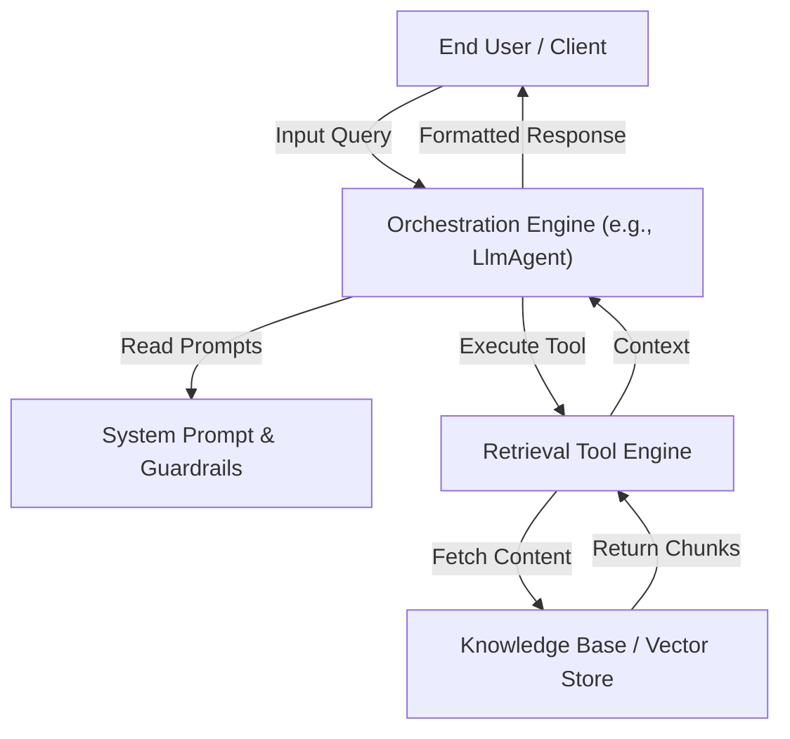
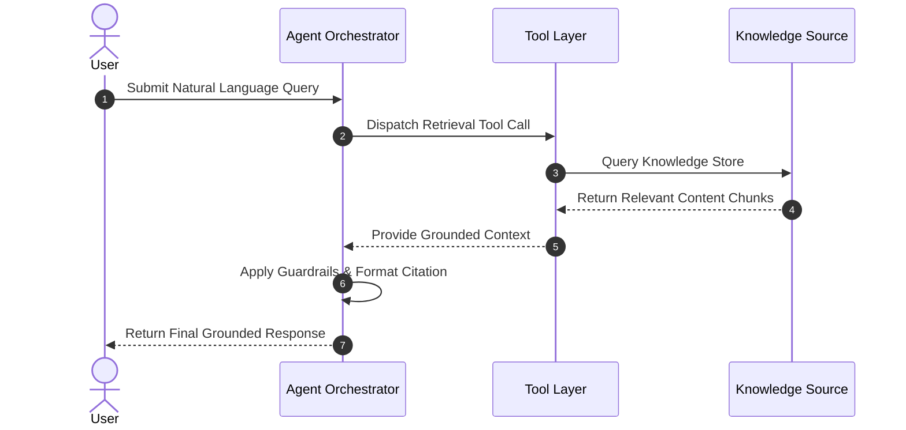
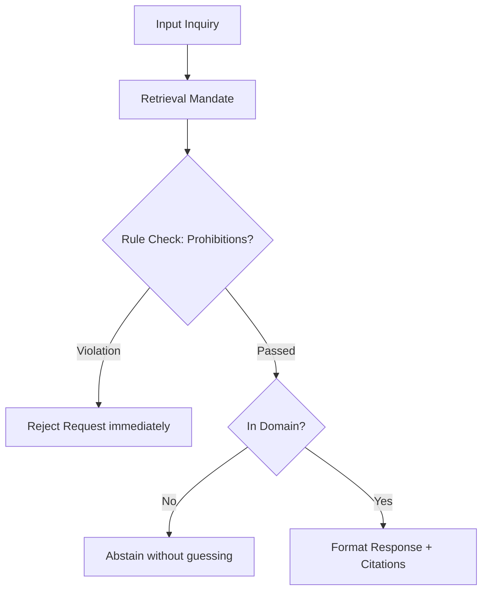

# Software Design Document (SDD) Template

> **Instructions for Authors:**  
> Use this template to document system architectures, component designs, data models, and verification strategies for AI agents and software engineering projects. Fill in each section according to your specific project requirements. Remove guidance prompts blockquoted with `>` before finalizing.

**Document Status:** [Draft / Under Review / Final Approved Design]  
**Author(s):** [Author Names / Teams]  
**Date:** [YYYY-MM-DD]  
**Version:** [1.0.0]  
**Target System:** [e.g., Google ADK LlmAgent / Web Service / Pipeline]

---

## 1. Executive Summary & Business Context

> **Guidance:** Summarize the business problem, proposed technical solution, and overarching objectives. Keep this section accessible to non-technical stakeholders while providing clear architectural context for engineers.

### 1.1 Problem Statement
- Describe the existing bottlenecks, failure modes, or pain points.
- Explain the business and compliance risks of maintaining the current state.

### 1.2 Business Objectives
- List 3-5 quantifiable goals the system is designed to achieve (e.g., grounding accuracy, latency, ticket deflection).

### 1.3 Scope, Goals & Non-Goals
* **In-Scope Goals:**
  * [Core system capability 1]
  * [Core system capability 2]
* **Non-Goals (Out of Scope):**
  * [Explicit exclusion 1]
  * [Explicit exclusion 2]

### 1.4 Definitions, Acronyms & Abbreviations
| Term / Acronym | Definition |
|---|---|
| **BRD** | Business Requirements Document |
| **SDD** | Software Design Document |
| **ADK** | Agent Development Kit |
| **RAG** | Retrieval-Augmented Generation |

---

## 2. System Overview & High-Level Architecture

> **Guidance:** Provide a high-level architectural summary and Mermaid diagrams illustrating major subsystems, external dependencies, and request/response data flows.

### 2.1 Architectural Approach
- Describe the core design patterns (e.g., Pluggable Dual-Brain Retrieval, Event-Driven Orchestration, Microservices).
- Detail why this approach was selected over alternative designs.

### 2.2 High-Level Architecture Diagram

### 2.3 End-to-End Request/Response Flow

---

## 3. Component & API Design

> **Guidance:** Detail each core system component, its responsibilities, exposed programmatic interfaces, inputs, outputs, and error handling behaviors.

### 3.1 Orchestration Engine
- **Responsibility:** [e.g., Context window management, prompt injection, tool dispatching]
- **Specification:** [e.g., ADK `LlmAgent` configuration, runtime lifecycle]

### 3.2 Tool & Plugin Interfaces
- **Tool Name:** `[e.g., read_concept / search_policy_docs]`
  - **Purpose:** [Description of what the tool does]
  - **Input Schema:** `[Parameter types and validation rules]`
  - **Output Schema:** `[Structured JSON response shape]`
  - **Error Handling:** `[Behavior on missing resources or invalid inputs]`

### 3.3 Configuration Subsystem
- Describe environment variables, feature flags, and runtime switches (e.g., `RETRIEVAL_MODE`, `MODEL_NAME`).

---

## 4. Prompt Engineering & Guardrails Architecture

> **Guidance:** Document system instructions, compliance guardrails, safety filters, and boundary conditions enforced at the LLM prompt level.

### 4.1 Core System Rules
1. **Retrieval-First Mandate:** [Rule specifying that retrieval tools must be called before answering]
2. **Priority Rules:** [Rules governing overrides, such as prohibitions overriding dollar caps]
3. **Abstention Protocol:** [Rules specifying how to refuse out-of-domain queries cleanly]
4. **Citation Standard:** [Mandatory formatting rules for appending source citations]

---

## 5. Data Model & Storage Architecture

> **Guidance:** Document persistent storage, database schemas, file structures, knowledge bundles, or vector index configurations.

### 5.1 Storage Schema
- Describe data entities, file directory structures (e.g., Open Knowledge Format `knowledge/`), or vector database schemas.
- Specify indexing pipelines, metadata tags, and update frequencies.

---

## 6. Verification, Evaluation & QA Architecture

> **Guidance:** Detail automated testing suites, LLM-as-judge rubrics, CI/CD regression harnesses, and quality acceptance criteria.

### 6.1 Evaluation Harness
- **Test Set:** Describe canonical test suites (e.g., `evals/policy_eval.json`).
- **Runner:** Specify automation scripts (e.g., `evals/run_eval.py`).

### 6.2 Rubric Dimensions
| Dimension | Weight | Description | Scoring Criteria (0 / 1 / 2) |
|---|---|---|---|
| **Correctness** | 3 | Factual accuracy | 2: All correct, 1: Partial, 0: Wrong |
| **Grounding** | 3 | Zero hallucination | 2: Fully supported, 1: Unsupported claim, 0: Hallucination |
| **Reasoning** | 3 | Gotcha & math handling | 2: Shows rule/math, 1: Implicit, 0: Falls for trap |
| **Abstention** | 2 | Clean refusal | 2: Refuses cleanly, 1: Hedges, 0: Answers out of domain |
| **Citation** | 1 | Attribution quality | 2: Exact section cited, 1: Generic/wrong, 0: No citation |

---

## 7. Requirements-to-Design Traceability Matrix

| BRD Requirement ID | Business Requirement Description | SDD Architectural Component | Verification & Eval Rubric Dimension |
|---|---|---|---|
| **REQ-01** | [Requirement description] | [Responsible component / tool / prompt rule] | [Rubric dimension & test case] |
| **REQ-02** | [Requirement description] | [Responsible component / tool / prompt rule] | [Rubric dimension & test case] |
